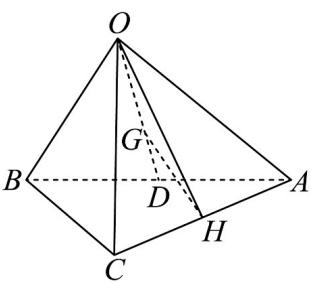

> [!faq]- 《专题01空间向量及其运算的四大常考题型_高效培优专项训练_》官方解析
>
> > [!success]- **【答案】** A
>
> > [!note]- **【分析】**
> > 根据空间向量的线性运算可得结果·
>
> > [!note]- **【解析】**
> > 
> >
> > 如图，连接 $OH$ ，连接 $OG$ 并延长交 $AB$ 于点 $D$ ，则 $D$ 为 $AB$ 中点，且 $\overrightarrow{OG} = \frac{2}{3}\overrightarrow{OD}$ ， $\therefore \overrightarrow{OG} = \frac{2}{3} \cdot \frac{1}{2}\left(\overrightarrow{OA} + \overrightarrow{OB}\right) = \frac{1}{3}\left(\overrightarrow{a} + \overrightarrow{b}\right)$ . $\because H$ 为 $AC$ 的中点， $\therefore \overrightarrow{OH} = \frac{1}{2}\left(\overrightarrow{OA} + \overrightarrow{OC}\right) = \frac{1}{2}\left(\overrightarrow{a} + c\right)$ ， $\therefore \overrightarrow{GH} = \overrightarrow{OH} - \overrightarrow{OG} = \frac{1}{2}\left(\overrightarrow{a} + c\right) - \frac{1}{3}\left(\overrightarrow{a} + b\right) = \frac{1}{6} a - \frac{1}{3} b + \frac{1}{2} c$
> >
> > 故选 **A**.
