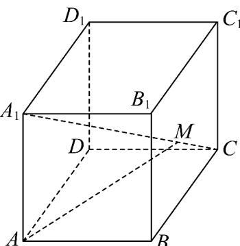

> [!faq]- 《专题01空间向量及其运算的四大常考题型_高效培优专项训练_》官方解析
>
> > [!success]- **【答案】** B
>
> > [!note]- **【分析】**
> > 根据空间向量的线性运算求得正确答案·
>
> > [!note]- **【解析】**
> > $\frac{OA}{OP}=\frac{OA+AP=OA+\frac{2}{3}AN}{OA+\frac{2}{3}(ON-OA)=\frac{1}{3}OA+\frac{2}{3}ON}$ $=\frac{1}{3}\frac{OA}{OA}+\frac{2}{3}\times\frac{2}{3}OM=\frac{1}{3}OA+\frac{4}{9}OM$ $=\frac{1}{3}OA+\frac{4}{9}\times\frac{1}{2}\left(OB+OC\right)=\frac{1}{3}OA+\frac{2}{9}OB+\frac{2}{9}OC.$
> >
> > 故选：B
> >
> > 9. 平行六面体 $ABCD - A_1B_1C_1D_1$ 中， $A_1M = \lambda MC, AM = \frac{2}{3} AB + \frac{2}{3} AD + \frac{1}{3} AA_1$ ，则实数 $\lambda$ 的值为（ ）A. 1 B. $\frac{1}{2}$ C. 2 D. 3
> >
> > 【答案】C
> >
> > 【分析】将 $A_{1}M, A_{1}C$ 都用基底 $AB, AD, AA_{1}$ 表示出来，得到 $A_{1}M = \frac{2}{3} A_{1}C$ ，即可得到 $A_{1}M = 2MC$ 【详解】 $A_{1}M = AM - AA_{1} = \frac{2}{3} AB + \frac{2}{3} AD + \frac{1}{3} AA_{1} - AA_{1} = \frac{2}{3} AB + \frac{2}{3} AD - \frac{2}{3} AA_{1}$ $= \frac{2}{3}(AB + AD - AA_{1}) = \frac{2}{3}(AC - AA_{1}) = \frac{2}{3} A_{1}C = \frac{2}{3}(A_{1}M + MC)$ ，所以 $A_{1}M = 2MC$ ，
> >
> > 故选：C.
> >
> > 
