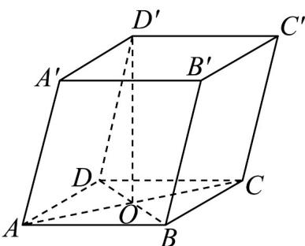

<!-- question-source:start -->
14. 如图所示，在四棱柱中， $\vec{AB} = \vec{a}$ ， $\vec{AD} = \vec{b}$ ， $\vec{AA}' = \vec{c}$ ， $AC \cap BD = O$ ，则向量 $D'O$ 可表示为（）

A. $-\frac{\vec{a}}{2} +\frac{\vec{b}}{2} +\vec{c}$ B. $\frac{\vec{a}}{2} -\frac{\vec{b}}{2} -\vec{c}$

C. $\vec{a} -\frac{\vec{b}}{2} +\vec{c}$ D. $\vec{a} -\vec{b} -\frac{\vec{c}}{2}$
<!-- question-source:end -->

![[高中/课堂同步/题库/人教A版高中数学同步讲义(2026)/03_选择性必修第一册/第一章 空间向量与立体几何/专项训练/专题01空间向量及其运算的四大常考题型_高效培优专项训练_/题型二_sec_03/questions/answers/Q00062653A1.md]]
