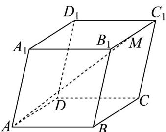

<!-- question-source:start -->
25. 在平行六面体 $ABCD - A_{1}B_{1}C_{1}D_{1}$ 中 $\angle BAD = 90^{\circ}$ ， $AB = AD = AA_{1} = 1$ ， $\angle BAA_{1} = \angle DAA_{1} = 60^{\circ}$ 。取棱 $B_{1}C_{1}$ 的中点 $M$ ，则 $\left|\overline{AM}\right| = (\quad)$

A. $\frac{\sqrt{15}}{3}$ B. $\frac{\sqrt{15}}{2}$ C. $\frac{\sqrt{10}}{2}$ D. $\frac{\sqrt{10}}{3}$
<!-- question-source:end -->

![[高中/课堂同步/题库/人教A版高中数学同步讲义(2026)/03_选择性必修第一册/第一章 空间向量与立体几何/专项训练/专题01空间向量及其运算的四大常考题型_高效培优专项训练_/题型二_sec_03/questions/answers/Q00062663A1.md]]
