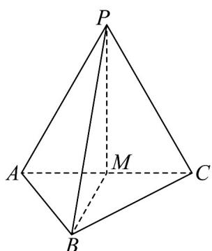

<!-- question-source:start -->
27. 如图，在三棱锥 $P - ABC$ 中， $PA = AC = PC = AB = a$ ， $PA \perp AB$ ， $AC \perp AB$ ， $M$ 为 $AC$ 中点·

(1)求证： $PM \perp$ 平面 ABC，并求直线 PB 和平面 ABC 所成角的正切值；

(2)设点 $G$ 是 $\triangle PBC$ 的重心，用向量 $AP$ 、 $AB$ 、 $AC$ 表示 $AG$ ，并求点A到点 $G$ 的距离.
<!-- question-source:end -->

![[高中/课堂同步/题库/人教A版高中数学同步讲义(2026)/03_选择性必修第一册/第一章 空间向量与立体几何/专项训练/专题01空间向量及其运算的四大常考题型_高效培优专项训练_/题型二_sec_03/questions/answers/Q00062665A1.md]]
