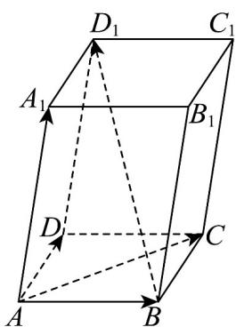

<!-- question-source:start -->
30. 如图所示，平行六面体 $ABCD - A_1B_1C_1D_1$ 中， $AB = AD = 1$ ， $AA_1 = 2$ ， $\angle BAD = \frac{\pi}{2}$ ，

$$
\angle B A A _ {1} = \angle D A A _ {1} = \frac {\pi}{3}
$$

(1)求 $BD_{1}\cdot AC$ ;

(2)求 $AC_{1}$ 的长度.
<!-- question-source:end -->

![[高中/课堂同步/题库/人教A版高中数学同步讲义(2026)/03_选择性必修第一册/第一章 空间向量与立体几何/专项训练/专题01空间向量及其运算的四大常考题型_高效培优专项训练_/题型二_sec_03/questions/answers/Q00062668A1.md]]
