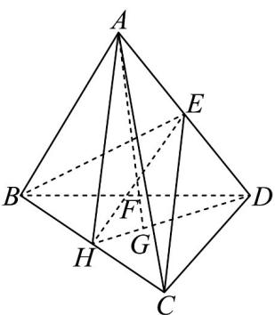

> [!faq]- 《专题01空间向量及其运算的四大常考题型_高效培优专项训练_》官方解析
>
> > [!success]- **【答案】** C
>
> > [!note]- **【分析】**
> > 根据共线定理及空间向量线性运算可得结果·
>
> > [!note]- **【解析】**
> > 如图：连接 DG 交 BC 于 H，则 H 为 BC 中点，连接 AH, EH, AG，
> > 因为 $AG \subset$ 平面 AHD， $EH \subset$ 平面 AHD，设 $AG \cap EH = K$ ，则 $K \in EH, K \in AG$ ，
> > 又 $EH \subset$ 平面 BCE，所以 $K \in$ 平面 BCE，故 K 为 AG 与平面 BCE 的交点，
> > 又因为 AG 与平面 BCE 交于点 F，所以 F 与 K 重合，
> > 又 E 为 AD 的中点，G 为平面 BCD 的重心，
> > 因为点 A, F, G 三点共线，则 $AF = mAG = m\left(AD + DG\right) = m\left(\frac{AD}{3} + \frac{2}{DH}\right)$ $=m\left(\overrightarrow{AD}+\frac{2}{3}\times\frac{\overrightarrow{DB}+\overrightarrow{DC}}{2}\right)=m\left[\overrightarrow{AD}+\frac{1}{3}\times\left(\overrightarrow{AB}-\overrightarrow{AD}+\overrightarrow{AC}-\overrightarrow{AD}\right)\right]$ $=\frac{1}{3}m\left(\overrightarrow{AD}+\overrightarrow{AB}+\overrightarrow{AC}\right)$ 又因为点 E, F, H 三点共线，则 $AF = xAH + yAE, (x + y = 1)$ ，
> > 所以 $\left\{\begin{aligned}&\frac{m}{3}=\frac{x}{2}\\&x+y=1\\&\frac{m}{3}=\frac{y}{2}\end{aligned}\right.$ ，解得，即，故
> >
> > 故选：C.
> >
> > 
