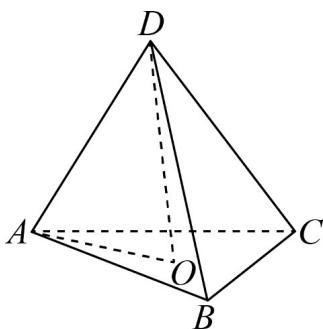

> [!faq]- 《专题01空间向量及其运算的四大常考题型_高效培优专项训练_》官方解析
>
> > [!success]- **【答案】** B
>
> > [!note]- **【分析】**
> > 根据向量的线性运算法则，准确运算，即可求解·
>
> > [!note]- **【解析】**
> > 因为四面体 DABC 是正四面体，则每个面都是正三角形，
> >
> > 所以 $\overline{DO} = \overline{DA} +\overline{AO} = \overline{DA} +\frac{1}{3}\left(\overline{AB} +\overline{AC}\right) = \overline{DA} +\frac{1}{3}\left(\overline{DB} -\overline{DA} +\overline{DC} -\overline{DA}\right)$ $= \frac{1}{3}\overline{DA} +\frac{1}{3}\overline{DB} +\frac{1}{3}\overline{DC}.$
> >
> > 又由 $\overline{DO}=x\overline{DA}+y\overline{DB}+z\overline{DC}$ ，所以 x=y=z= $\frac{1}{3}$ .
> >
> > 故选：B.
> >
> > 
