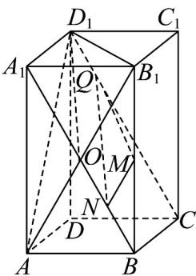

> [!faq]- 《专题01空间向量及其运算的四大常考题型_高效培优专项训练_》官方解析
>
> > [!success]- **【答案】** A
>
> > [!note]- **【分析】**
> > 根据给定条件 $\overline{BP} = \lambda \overline{BC} + \mu \overline{BA}_{1}$ ，可得点 $P$ 在矩形 $A_{1}BCD_{1}$ 及内部，结合 $MP //$ 平面 $AB_{1}D_{1}$ ，利用面
> > 面平行的知识找出点 $P$ 的轨迹，然后根据长方体的结构特征与解三角形的知识算出答案·
>
> > [!note]- **【解析】**
> > 在长方体 $ABCD - A_{1}B_{1}C_{1}D_{1}$ 中，由 $\overline{BP} = \lambda \overline{BC} +\mu \overline{BA}_{1}$ ， $\lambda \in [0,1]$ ， $\mu \in [0,1]$ ，得点 $P$ 在矩形 $A_{1}BCD_{1}$ 及内部，
> >
> > 又 $MP / /$ 平面 $AB_{1}D_{1}$ ，故点 $P$ 在过 $M$ 且平行于平面 $AB_{1}D_{1}$ 的平面内，
> >
> > 连接 $AB_{1}$ 交 $A_{1}B$ 于点 O，取 OB 中点 N，连接 MN，在 $CD_{1}$ 上取点 Q，使得 $D_{1}Q = \frac{1}{4}CD_{1}$ ，连接 MQ，NQ， $OD_{1}$
> >
> > $$
> > A B C D - A _ {1} B _ {1} C _ {1} D _ {1}
> > $$
> >
> > $$
> > A _ {1} B C D _ {1}
> > $$
> >
> > $$
> > A _ {1} B / / D _ {1} C
> > $$
> >
> > $$
> > A _ {1} B = D _ {1} C
> > $$
> >
> > 因为 $D_{1}Q = \frac{1}{4} CD_{1}$ ， $ON = \frac{1}{2} OB = \frac{1}{4} A_{1}B$
> >
> > 所以 $D_{1}Q // ON$ 且 $D_{1}Q = ON$ ，四边形 $D_{1}QNO$ 为平行四边形，可得 $D_{1}O // QN$
> >
> > $$
> > D _ {1} O \subset
> > $$
> >
> > $$
> > A B _ {1} D _ {1}
> > $$
> >
> > $$
> > Q N \not \subset
> > $$
> >
> > $$
> > A B _ {1} D _ {1}
> > $$
> >
> > 所以 $QN \parallel$ 平面 $AB_{1}D_{1}$ ，同理可得 $MN \parallel$ 平面 $AB_{1}D_{1}$ ，
> >
> > 因为 $QN, MN$ 是平面 $MNQ$ 内的相交直线，故平面 $MNQ // \text{平面} AB_1D_1$ ，即平面 $MNQ$ 是过 $M$ 且平行于平面 $AB_1D_1$ 的平面，所以点 $P$ 的轨迹是四边形截面 $A_1BCD_1$ 与平面 $MNQ$ 的交线，即线段 $NQ$ .
> >
> > 因为矩形 $AA_{1}B_{1}B$ 中， $AB = 2$ ， $AA_{1} = 4$ ，可知 $A_{1}B = \sqrt{2^{2} + 4^{2}} = 2\sqrt{5}$
> >
> > 所以 $A_{1}O=\frac{1}{2}A_{1}B=\sqrt{5}$ ，可得 $Rt\triangle A_{1}OD_{1}$ 中， $D_{1}O=\sqrt{A_{1}D_{1}^{2}+A_{1}O^{2}}=\sqrt{2^{2}+\sqrt{5}^{2}}=3$ ，
> > 所以 $NQ = D_{1}Q = 3$ ，即动点 P 的轨迹所形成的轨迹长度为 3.
> >
> > 
> >
> > 故选 **A**
