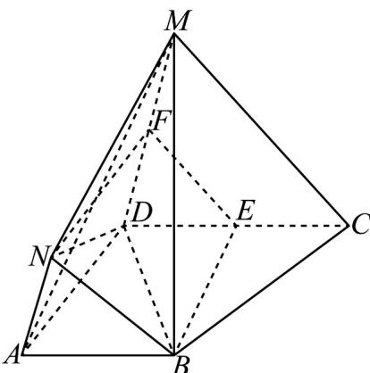

> [!faq]- 《专题01空间向量及其运算的四大常考题型_高效培优专项训练_》官方解析
>
> > [!success]- **【答案】** $^{(1)}$ 证明见解析 (2) $\frac{56\sqrt{3}}{3}$
>
> > [!note]- **【分析】**
> > （1）由已知可得 $AB // DC, AN // DM$ ，由线面平行的判定可得 $AB \parallel$ 平面 $DCM$ ， $AN \parallel$ 平面 $DCM$ 再由面面平行的判定可得平面 $ABN \parallel$ 平面 $DCM$ ，然后由面面平行的性质可得结论，
> >
> > (2) 取 $DC, DM$ 的中点分别为 $E, F$ ，连接 $BE, EF, FN$ ，则由已知条件可得四边形 $ABED$ 和四边形 $ADFN$ 都是平行四边形，从而可得四边形 $BEFN$ 是平行四边形，则可得该几何体为三棱台 $ABN-DCM$ ，然后结合已知数据可求出棱台的体积
>
> > [!note]- **【解析】**
> > （1）证明：∵ $\overline{DC}=2AB, DM=2AN$ ∴ AB // DC, AN // DM
> > ∵ AB, AN ∉ 平面 DCM，DC, DM ⊂ 平面 DCM
> > ∴ AB ∥ 平面 DCM，AN ∥ 平面 DCM，
> > ∵ AB ∩ AN = A
> > ∴ 平面 ABN ∥ 平面 DCM
> > ∵ BN ⊂ 平面 ABN
> > ∴ BN ∥ 平面 DCM.
> >
> > $$
> > E, F
> > $$
> >
> > $$
> > B E, E F, F N
> > $$
> >
> > $$
> > \because D C = 2 A B, D M = 2 A N, \therefore A B = D E, A N = D F
> > $$
> >
> > ∴四边形ABED和四边形ADFN都是平行四边形，
> >
> > $$
> > \therefore B E / / A D, A D / / F N, B E = A D, A D = F N, \therefore B E / / F N, B E = F N
> > $$
> >
> > 则四边形 BEFN 是平行四边形，
> >
> > $\therefore BE \parallel AD, EF \parallel CM, BN \parallel CM$
> >
> > 结合（1）证知，该几何体为三棱台 $ABN - DCM$ ， $\because AD \perp DC, AD \perp DM, DC \cap DM = D$ ， $\therefore AD \perp$ 平面 $DCM$ ， $\because S_{\triangle ABN} = \frac{1}{2} \times 2 \times 4 \times \frac{\sqrt{3}}{2} = 2\sqrt{3}, S_{\triangle DCM} = \frac{1}{2} \times 4 \times 8 \times \frac{\sqrt{3}}{2} = 8\sqrt{3}$ 故该几何体的体积为 $V = \frac{1}{3} \times (2\sqrt{3} + 8\sqrt{3} + \sqrt{2\sqrt{3} \times 8\sqrt{3}}) \times 4 = \frac{56\sqrt{3}}{3}$ .
> >
> > 
> >
> > 题型三：空间向量的数量积
