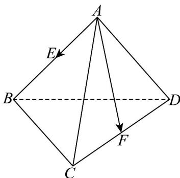

> [!faq]- 《专题01空间向量及其运算的四大常考题型_高效培优专项训练_》官方解析
>
> > [!success]- **【答案】** B
>
> > [!note]- **【分析】**
> > 由数量积的定义以及运算律代入计算，即可得到结果·
>
> > [!note]- **【解析】**
> > 依题意，有 $\left|\overline{AB}\right|=\left|\overline{AC}\right|=\left|\overline{AD}\right|=2$ ， $\left\langle\overline{AB},\overline{AC}\right\rangle=\left\langle\overline{AB},\overline{AD}\right\rangle=60^{\circ}$ ，设 $\overline{CF}=\lambda\overline{CD}$ ，
> >
> > 
> >
> > 则 $AE\cdot AF = \left(\frac{1}{2} AB\right)\cdot \left[\left(1 - \lambda\right)AC + \lambda AD\right] = \frac{1 - \lambda}{2} AB\cdot AC + \frac{\lambda}{2} AB\cdot AD$ $= \frac{1 - \lambda}{2}\big|AB\big|\big|AC\big|\cos \big\langle AB,AC\big\rangle +\frac{\lambda}{2}\big|AB\big|\big|AD\big|\cos \big\langle AB,AD\big\rangle$ $= \frac{1 - \lambda}{2}\times 2\times 2\times \frac{1}{2} +\frac{\lambda}{2}\times 2\times 2\times \frac{1}{2} = 1.$
> >
> > 故选 **B**
