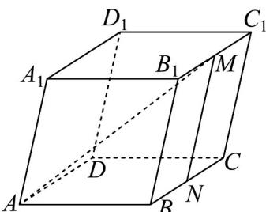

> [!faq]- 《专题01空间向量及其运算的四大常考题型_高效培优专项训练_》官方解析
>
> > [!success]- **【答案】** B
>
> > [!note]- **【分析】**
> > 取 BC 的中点 N，连接 MN，结合图形由向量的加法和数量积的运算律以及数量积的定义计算可得.
>
> > [!note]- **【解析】**
> > 取 BC 的中点 N ，连接 MN ，
> >
> > 由图形可得 $AM = AB + BN + NM$
> >
> > 所以 $\left|AM\right|^{2}=\left(AB+BN+NM\right)^{2}$
> >
> > $$
> > = \left| \begin{array}{c} \text {UUU} \\ A B \end{array} \right| ^ {2} + \left| \begin{array}{c} \text {UUU} \\ B N \end{array} \right| ^ {2} + \left| \begin{array}{c} \text {UUU} \\ N M \end{array} \right| ^ {2} + 2 \left| \begin{array}{c} \text {UUU} \\ A B \end{array} \right| \left| \begin{array}{c} \text {UUU} \\ B N \end{array} \right| \cos 9 0 ^ {\circ} + 2 \left| \begin{array}{c} \text {UUU} \\ A B \end{array} \right| \left| \begin{array}{c} \text {UUU} \\ N M \end{array} \right| \cos 6 0 ^ {\circ} + 2 \left| \begin{array}{c} \text {UUU} \\ N M \end{array} \right| \left| \begin{array}{c} \text {UUU} \\ B N \end{array} \right| \cos 6 0 ^ {\circ}
> > $$
> >
> > $$
> > = 1 + \frac {1}{4} + 1 + 0 + 2 \times 1 \times 1 \times \frac {1}{2} + 2 \times 1 \times \frac {1}{2} \times \frac {1}{2} = \frac {1 5}{4}
> > $$
> >
> > 所以 $\left|\overrightarrow{AM}\right|=\frac{\sqrt{15}}{2}$ .
> >
> > 故选：B
> >
> > 
