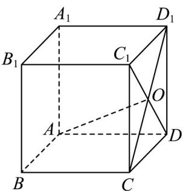

<!-- question-source:start -->
32. 如图，正方体 $ABCD - A_{1}B_{1}C_{1}D_{1}$ 的棱长是 $a$ ， $CD_{1}$ 和 $DC_{1}$ 相交于点 $O$

(1)求 $CD_{1}\cdot CD$ ;

(2) 判断 $\stackrel{\square\square}{AO}$ 与 $\stackrel{\square\square\square}{CD}_{1}$ 是否垂直.
<!-- question-source:end -->

![[高中/课堂同步/题库/人教A版高中数学同步讲义(2026)/03_选择性必修第一册/第一章 空间向量与立体几何/专项训练/专题01空间向量及其运算的四大常考题型_高效培优专项训练_/题型四_sec_04/questions/answers/Q00062670A1.md]]
