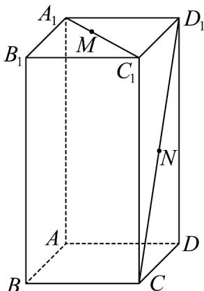

<!-- question-source:start -->
36. 在长方体 $ABCD - A_{1}B_{1}C_{1}D_{1}$ 中， $AB = AD = 2$ ， $AA_{1} = 4$ ，点 $M$ 在 $A_{1}C_{1}$ 上 $\left|MC_{1}\right| = 2\left|A_{1}M\right|$ ， $N$ 在 $D_{1}C$ 上且为 $D_{1}C$ 中点.

(1) 求 M 、 N 两点间的距离；

(2) 判断直线 $MN$ 与直线 $BD_{1}$ 是否垂直，并说明理由
<!-- question-source:end -->

![[高中/课堂同步/题库/人教A版高中数学同步讲义(2026)/03_选择性必修第一册/第一章 空间向量与立体几何/专项训练/专题01空间向量及其运算的四大常考题型_高效培优专项训练_/题型四_sec_04/questions/answers/Q00062674A1.md]]
