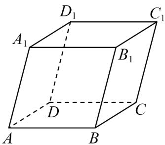

<!-- question-source:start -->
2．如图，在平行六面体 $ABCD-A_{1}B_{1}C_{1}D_{1}$ 中，设 $a=AA_{1}$ ， $b=DB_{1}$ ，若 a、b、c 组成空间向量的一个基底，则 c 可以是（）

A. $BB_{1}$ B. $BC_{1}$ C. BD D. $BD_{1}$
<!-- question-source:end -->

![[高中/课堂同步/题库/人教A版高中数学同步讲义(2026)/03_选择性必修第一册/第一章 空间向量与立体几何/专项训练/专题02空间向量基本定理及其坐标表示四大常考题型_高效培优专项训练_/题型一_sec_02/questions/answers/Q00062676A1.md]]
