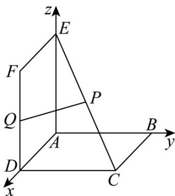

> [!faq]- 《专题02空间向量基本定理及其坐标表示四大常考题型_高效培优专项训练_》官方解析
>
> > [!success]- **【答案】** A
>
> > [!note]- **【分析】**
> > 根据题设条件建系，写出相关点的坐标，设 $P(x,y,z)$ ，则由 $CP=\lambda CE(0\leq\lambda\leq1)$ ，可求得 $P(x,x,2-x)$ ，利用空间两点之间距离公式和二次函数的最值求出线段PQ长度的范围即可。
>
> > [!note]- **【解析】**
> > 如图所示，以A为原点，以AD,AB,AE所在直线分别为x轴，y轴，z轴正方向，
> > 建立空间直角坐标系，则 $A(0,0,0)$ 、 $D(2,0,0)$ 、 $C(2,2,0)$ 、 $E(0,0,2)$ 、 $F(2,0,2)$ 、 $Q(2,0,1)$ ·设 $P(x,y,z)$ ，由点P是CE上的动点，知 $CP=\lambda CE(0\leq\lambda\leq1)$ ，即 $(x-2,y-2,z)=\lambda(-2,-2,2)$ ，∴x=y,z=2-x，故 $P(x,x,2-x)$ ∴ $PQ=\sqrt{(2-x)^{2}+(-x)^{2}+(x-1)^{2}}=\sqrt{3x^{2}-6x+5}=\sqrt{3(x-1)^{2}+2},(0\leq x\leq2)$ 所以 $\sqrt{2}\leq PQ\leq\sqrt{5}$
> >
> > 
> >
> > 故选：A
> >
> > 27. 向量 $a = (x, 1, 1)$ ， $b = (1, y, 1)$ ， $c = (2, -4, 2)$ ，且 $a \perp c$ ， $b // c$ ，则 $\left|2a + b\right| = (\quad)$ A. $\sqrt{6}$ B. $2\sqrt{2}$ C. $3\sqrt{2}$ D. $2\sqrt{3}$
> >
> > 【答案】C
> >
> > 【分析】由向量的关系列式求解 x，y 的值，再运用向量的数乘及加法的坐标表示公式，结合向量的模公式计算得出结果.
> >
> > 【详解】由 $a \perp c, b // c$ ，则 $\left\{ \begin{array}{l} 2x - 4 + 2 = 0 \\ \frac{1}{2} = \frac{y}{-4} \end{array} \right.$ ，解得 $x = 1, y = -2$
> >
> > $$
> > \therefore \stackrel {1} {a} = (1, 1, 1), b = (1, - 2, 1)
> > $$
> >
> > $$
> > \therefore 2 \stackrel {1} {a} + \stackrel {1} {b} = (3, 0, 3)
> > $$
> >
> > $$
> > \therefore \left| 2 ^ {1} a + b ^ {1} \right| = \sqrt {9 + 9} = 3 \sqrt {2}.
> > $$
> >
> > 故选 **C**.
