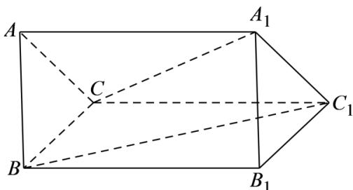

<!-- question-source:start -->
19. 已知在三棱柱 $ABC - A_{1}B_{1}C_{1}$ 中， $AB = AC = 2, AA_{1} = 3, \angle A_{1}AB = \angle A_{1}AC = 60^{\circ}, \angle BAC = \alpha$ ，记 $AA_{1} = a$ ， $AB = b, AC = c$ .

(1)求证：四边形 $BB_{1}C_{1}C$ 为矩形；

(2) 若 $\alpha = 60^{\circ}$ , 求异面直线 $BC_{1}$ 与 $A_{1}C$ 所成角的余弦值.
<!-- question-source:end -->

![[高中/课堂同步/题库/人教A版高中数学同步讲义(2026)/03_选择性必修第一册/第一章 空间向量与立体几何/专项训练/专题02空间向量基本定理及其坐标表示四大常考题型_高效培优专项训练_/题型二_sec_03/questions/answers/Q00062688A1.md]]
