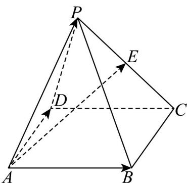
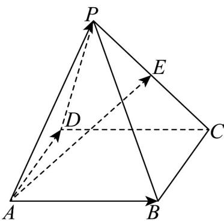

> [!faq]- 《专题02空间向量基本定理及其坐标表示四大常考题型_高效培优专项训练_》官方解析
>
> > [!success]- **【答案】** B
>
> > [!note]- **【分析】**
> > 由空间向量基本定理，用 $SA, SB, SC$ 表示 $SM$ ，由 $D$ ， $E$ ， $F$ ， $M$ 四点共面，可得存在实数 $\lambda, \mu$ 使 $DM = \lambda DE + \mu DF$ ，再转化为 $SM = (1 - \lambda - \mu)kSA + \lambda mSB + \mu nSC$ ，由空间向量分解的唯一性，列方程求其解可得结论：
>
> > [!note]- **【解析】**
> > 由题意可知，
> >
> > $\frac{\square\square\square}{SM} = \frac{1}{2}\frac{\square\square\square}{SG} = \frac{1}{2}\left(\frac{\square\square}{SA} +\frac{\square\square\square}{AG}\right) = \frac{1}{2}\left[\frac{\square\square}{SA} +\frac{2}{3}\times \frac{1}{2}\left(\frac{\square\square\square}{AB} +\frac{\square\square\square}{AC}\right)\right]\\ = \frac{1}{2}\left[\frac{\square\square}{SA} +\frac{1}{3}\left(\frac{\square\square}{SB} -\frac{\square\square}{SA}\right) + \frac{1}{3}\left(\frac{\square\square\square}{SC} -\frac{\square\square}{SA}\right)\right] = \frac{1}{6}\frac{\square\square}{SA} +\frac{1}{6}\frac{\square\square}{SB} +\frac{1}{6}\frac{\square\square\square}{SC}$
> >
> > 因为 $D$ ， $E$ ， $F$ ， $M$ 四点共面，
> >
> > 所以存在实数 $\lambda, \mu$ ，使 $DM = \lambda DE + \mu DF$
> >
> > 所以 $\overline{SM}-\overline{SD}=\lambda\left(\overline{SE}-\overline{SD}\right)+\mu\left(\overline{SF}-\overline{SD}\right)$
> >
> > 所以
> >
> > $$
> > \stackrel {{\square \square \square}} {S M} = (1 - \lambda - \mu) \stackrel {{\square \square \square}} {S D} + \lambda \stackrel {{\square \square \square}} {S E} + \mu \stackrel {{\square \square \square}} {S F} = (1 - \lambda - \mu) k \stackrel {{\square \square \square}} {S A} + \lambda m \stackrel {{\square \square \square}} {S B} + \mu n S C
> > $$
> >
> > 所以
> >
> > $\left\{ \begin{array}{l} (1 - \lambda - \mu)k = \frac{1}{6} \\ \lambda m = \frac{1}{6} \\ \mu n = \frac{1}{6} \end{array} \right.$ ，所以
> >
> > 故选：B.
> >
> > 14. 四棱锥 $P - ABCD$ 中，底面 $ABCD$ 是平行四边形，点 $E$ 为棱 $PC$ 的中点，若 $AE = xAB + yAD + zAP$ ，则 $x + y + z$ 等于（）
> >
> > 
> >
> > A. $\frac{3}{2}$ B. 1 C. $\frac{5}{2}$ D. 2
> >
> > 【答案】A
> >
> > 【分析】结合图形，利用向量的线性运算，即可求解·
> >
> > 【详解】
> >
> > 
> >
> > 在四棱锥 $P - ABCD$ 中，有 $\overline{AE} = \overline{AP} +\overline{PE}$
> >
> > 再由点 E 为棱 PC 的中点， $\overline{PE}=\frac{1}{2}\overline{PC}$ ，所以 $\overline{AE}=\overline{AP}+\frac{1}{2}\overline{PC}$
> >
> > $$
> > P C = P B + B C = A B - A P + B C
> > $$
> >
> > 由底面 $ABCD$ 是平行四边形，得 $\overline{BC} = \overline{AD}$
> >
> > $$
> > \stackrel {\square \square \square} {A E} = \stackrel {\square \square \square} {A P} + \frac {1}{2} \left(\stackrel {\square \square \square} {A B} - \stackrel {\square \square \square} {A P} + \stackrel {\square \square \square} {B C}\right) = \frac {1}{2} \stackrel {\square \square \square} {A B} + \frac {1}{2} \stackrel {\square \square \square} {A P} + \frac {1}{2} \stackrel {\square \square \square} {B C} = \frac {1}{2} \stackrel {\square \square \square} {A B} + \frac {1}{2} \stackrel {\square \square \square} {A P} + \frac {1}{2} \stackrel {\square \square \square} {A D}
> > $$
> >
> > 又因为 $AE = xAB + yAD + zAP$ ，所以 $x = \frac{1}{2},y = \frac{1}{2},z = \frac{1}{2}$ ，即 $x + y + z = \frac{3}{2}$
> >
> > 15. 平行六面体 $ABCD - A_{1}B_{1}C_{1}D_{1}$ 中， $AC_{1} = xAB + 2yBC + 3zC_{1}C$ ，则 $x + y + z = (\quad)$ A. 1 B. $\frac{7}{6}$ C. $\frac{5}{6}$ D. $\frac{2}{3}$
> >
> > 【答案】B
> >
> > 【分析】根据空间向量线性运算法则利用 $AB, BC, C_1C$ 表示 $AC_1$ ，结合空间向量基本定理求 $x, y, z$ 可得结论·
> >
> > 【详解】由平行六面体 $ABCD - A_1B_1C_1D_1$ 可得 $AC_1 = AC + CC_1 = AB + BC - C_1C$ ，
> >
> > 又 $AC_{1} = xAB + 2yBC + 3zC_{1}C$ ，所以 $x = 1,2y = 1,3z = -1$
> >
> > 则 $x + y + z = 1 + \frac{1}{2} -\frac{1}{3} = \frac{7}{6}$
> >
> > 故选 **B**
