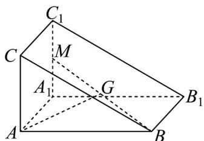
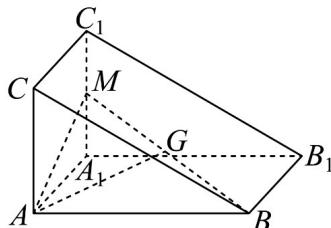

## 题型二：用空间向量基本定理解决相关的几何问题

11．《九章算术》中的“商功”篇主要讲述了以立体几何为主的各种形体体积的计算，其中堑堵是指底面为直角三角形且侧棱垂直于底面的三棱柱．如图，在堑堵 $ABC-A_{1}B_{1}C_{1}$ ，中，M是 $A_{1}C_{1}$ 的中点，G是MB的中点，若 $AG=xAB+yAA_{1}+xAC$ ，则 $x+y+z=(\quad)$

A. 1 B. 2 C. $\frac{3}{2}$ D. $\frac{5}{4}$

【答案】D

【分析】连接 AM ，根据空间向量法线性运算法则计算可得·

【详解】连接 $AM$ ，因为 $G$ 是 $MB$ 的中点，所以 $\overline{AG} = \frac{1}{2}\left(\overline{AM} +\overline{AB}\right)$

因为三棱柱 $ABC - A_{1}B_{1}C_{1}$ 是底面为直角三角形的直棱柱，

所以四边形 $ACC_{1}A_{1}$ 为长方形，又因为 $M$ 是 $A_{1}C_{1}$ 的中点，

所以 $AM = AA_{1} + A_{1}M = AA_{1} + \frac{1}{2}AC$

则 $AG = \frac{1}{2}\left(AM + AB\right) = \frac{1}{2}\left(AA_{1} + \frac{1}{2}AC\right) + \frac{1}{2}AB = \frac{1}{2}AB + \frac{1}{2}AA_{1} + \frac{1}{4}AC$

又，又，，，不共面，所以 $\left\{ \begin{array}{ll}x = \frac{1}{2}\\ y = \frac{1}{2}\\ z = \frac{1}{4} \end{array} \right.$ ，所以 $AG = xAB + yAA_{1} + zAC\quad \overline{AB}\quad AA_{1}\quad \overline{AC}$ $x + y + z = \frac{5}{4}$

故选：D.

![[高中/课堂同步/题库/人教A版高中数学同步讲义(2026)/03_选择性必修第一册/第一章 空间向量与立体几何/专项训练/专题02空间向量基本定理及其坐标表示四大常考题型_高效培优专项训练_/题型二_sec_03/questions/Q00062684.md]]
![[高中/课堂同步/题库/人教A版高中数学同步讲义(2026)/03_选择性必修第一册/第一章 空间向量与立体几何/专项训练/专题02空间向量基本定理及其坐标表示四大常考题型_高效培优专项训练_/题型二_sec_03/questions/Q00062685.md]]
![[高中/课堂同步/题库/人教A版高中数学同步讲义(2026)/03_选择性必修第一册/第一章 空间向量与立体几何/专项训练/专题02空间向量基本定理及其坐标表示四大常考题型_高效培优专项训练_/题型二_sec_03/questions/Q00062686.md]]
![[高中/课堂同步/题库/人教A版高中数学同步讲义(2026)/03_选择性必修第一册/第一章 空间向量与立体几何/专项训练/专题02空间向量基本定理及其坐标表示四大常考题型_高效培优专项训练_/题型二_sec_03/questions/Q00062687.md]]
![[高中/课堂同步/题库/人教A版高中数学同步讲义(2026)/03_选择性必修第一册/第一章 空间向量与立体几何/专项训练/专题02空间向量基本定理及其坐标表示四大常考题型_高效培优专项训练_/题型二_sec_03/questions/Q00062688.md]]
![[高中/课堂同步/题库/人教A版高中数学同步讲义(2026)/03_选择性必修第一册/第一章 空间向量与立体几何/专项训练/专题02空间向量基本定理及其坐标表示四大常考题型_高效培优专项训练_/题型二_sec_03/questions/Q00062689.md]]
