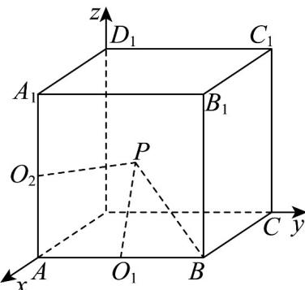

> [!faq]- 《专题02空间向量基本定理及其坐标表示四大常考题型_高效培优专项训练_》官方解析
>
> > [!success]- **【答案】** B
>
> > [!note]- **【分析】**
> > 我们先根据已知条件求出 $m, n, p$ 的值，再利用向量夹角公式求出 $\cos \angle AOB$ .
>
> > [!note]- **【解析】**
> > 已知向量 $\overline{OA}=(m,n,0)$ 是单位向量，则 $\left|\overline{OA}\right|=\sqrt{m^{2}+n^{2}+0^{2}}=1$ ，即 $m^{2}+n^{2}=1$ ，
> >
> > 因为向量 $\overline{OA}$ 与 $\overline{OC} = (1,1,1)$ 的夹角为 $\frac{\pi}{4}$ ，根据向量夹角公式可得：
> >
> > $\cos \frac{\pi}{4} = \frac{\square OA \cdot \square O C}{|OA||OC|}, \frac{\sqrt{2}}{2} = \frac{m + n + 0}{\sqrt{m^2 + n^2} \times \sqrt{1^2 + 1^2 + 1^2}}$ ，即 $m + n = \frac{\sqrt{6}}{2}$ ，
> >
> > 联立方程 $\left\{ \begin{array}{l}m^2 +n^2 = 1\\ m + n = \frac{\sqrt{6}}{2} \end{array} \right.$ ，将 $m = \frac{\sqrt{6}}{2} -n$ 代入 可得： $m^2 +n^2 = 1$
> >
> > $(\frac{\sqrt{6}}{2} - n)^2 + n^2 = 1, \frac{6}{4} - \sqrt{6} n + n^2 + n^2 = 1, 2n^2 - \sqrt{6} n + \frac{1}{2} = 0$ ，解得 $n = \frac{\sqrt{6} \pm \sqrt{2}}{4}$ ，
> >
> > 当 $n = \frac{\sqrt{6} + \sqrt{2}}{4}$ 时， $m = \frac{\sqrt{6} - \sqrt{2}}{4}$ ；当 $n = \frac{\sqrt{6} - \sqrt{2}}{4}$ 时， $m = \frac{\sqrt{6} + \sqrt{2}}{4}$ ，
> >
> > 因为向量 $OB = (0, n, p)$ 是单位向量，则 $\left|OB\right| = \sqrt{0^2 + n^2 + p^2} = 1$ ，即 $n^2 + p^2 = 1$
> >
> > 又因为向量 $\overline{OB}$ 与 $\overline{OC} = (1,1,1)$ 的夹角为 $\frac{\pi}{4}$ ，根据向量夹角公式可得：
> >
> > $\cos \frac{\pi}{4} = \frac{\square OB \cdot \square OG}{|OB||OC|}, \frac{\sqrt{2}}{2} = \frac{n + p + 0}{\sqrt{n^2 + p^2} \times \sqrt{1^2 + 1^2 + 1^2}}$ ，即 $n + p = \frac{\sqrt{6}}{2}$ ，
> >
> > 联立方程 $\left\{ \begin{array}{l} n^2 + p^2 = 1 \\ n + p = \frac{\sqrt{6}}{2} \end{array} \right.$ ，将 $p = \frac{\sqrt{6}}{2} - n$ 代入 可得： $n^2 + p^2 = 1$
> >
> > $n^2 + \left(\frac{\sqrt{6}}{2} - n\right)^2 = 1, n^2 + \frac{6}{4} - \sqrt{6} n + n^2 = 1, 2n^2 - \sqrt{6} n + \frac{1}{2} = 0$ ，解得 $n = \frac{\sqrt{6} \pm \sqrt{2}}{4}$ ，
> >
> > 当 $n = \frac{\sqrt{6} + \sqrt{2}}{4}$ 时， $p = \frac{\sqrt{6} - \sqrt{2}}{4}$ ；当 $n = \frac{\sqrt{6} - \sqrt{2}}{4}$ 时， $p = \frac{\sqrt{6} + \sqrt{2}}{4}$ ，
> >
> > 根据向量夹角公式， $\cos \angle AOB = \frac{\sqrt{OA} \cdot \sqrt{OB}}{|OA||OB|} = \frac{0 + n^2 + 0}{1\times 1} = n^2$
> >
> > 当 $n = \frac{\sqrt{6} + \sqrt{2}}{4}$ 时， $n^2 = \frac{2 + \sqrt{3}}{4}$ ；当 $n = \frac{\sqrt{6} - \sqrt{2}}{4}$ 时， $n^2 = \frac{2 - \sqrt{3}}{4}$ ，
> >
> > 所以 $\cos\angle AOB=\frac{2\pm\sqrt{3}}{4}$ .
> >
> > 故选：B.
> >
> > 36. 棱长为 $^{2}$ 的正方体 $ABCD-A_{1}B_{1}C_{1}D_{1}$ 中，其内部和表面上存在一点P满足 $AP\cdot BP=AP\cdot A_{1}P=0$ ，则$\angle ABP$ 的取值范围为（ ）A. $\left[\frac{\pi}{3},\frac{\pi}{2}\right)$ B. $\left[0,\frac{\pi}{4}\right]$ C. $\left[\frac{\pi}{6},\frac{\pi}{4}\right]$ D. $\left[\frac{\pi}{4},\frac{\pi}{3}\right]$
> >
> > 【答案】B
> >
> > 【分析】建立如图所示空间直角坐标系，设 $P(x,y,z)$ ，设 $AB$ 中点为 $O_{1}(2,1,0)$ ， $AA_{1}$ 中点为 $O_{2}(2,0,1)$ ，由 $AP \cdot BP = AP \cdot A_{1}P = 0$ 得 $\left|PO_{1}\right| = \left|PO_{2}\right| = 1$ ，确定 $P$ 点的轨迹，由数量积的定义计算向量夹角的余弦值，结合参数范围得余弦值范围，从而角的范围。
> >
> > 【详解】建立如图所示空间直角坐标系，则有 $A(2,0,0)$ 、 $B(2,2,0)$ 、 $A_{1}(2,0,2)$
> >
> > 
> >
> > 设 $P(x,y,z)$ ， $x$ 、 $y$ 、 $z\in [0,2]$ ，设 $AB$ 中点为 $O_{1}(2,1,0)$ ， $AA_{1}$ 中点为 $O_{2}(2,0,1)$ ，由 $\overline{AP} \cdot \overline{BP} = 0$ 得 $AP \perp BP$ ，则 $\left|PO_1\right| = 1$
> >
> > 即 $(x - 2)^{2} + (y - 1)^{2} + z^{2} = 1$
> >
> > 又 $AP \cdot A_1P = 0$ ，同理可得 $\left|PO_2\right| = 1$
> >
> > 即 $\left(x - 2\right)^{2} + y^{2} + \left(z - 1\right)^{2} = 1$ ，即 $\left\{ \begin{array}{l} \left(x - 2\right)^{2} + \left(y - 1\right)^{2} + z^{2} = 1 \\ \left(x - 2\right)^{2} + y^{2} + \left(z - 1\right)^{2} = 1 \end{array} \right.$
> >
> > 即 $\left\{ \begin{array}{l}x^{2} + y^{2} + z^{2} - 4x - 2y + 4 = 0\\ x^{2} + y^{2} + z^{2} - 4x - 2z + 4 = 0 \end{array} \right.$ ，故有 $y = z$
> >
> > 且 $x^{2} + 2y^{2} - 4x - 2y + 4 = 0$ ， $\overline{BP} = (x - 2,y - 2,z)$ ， $\overline{BA} = (0, - 2,0)$
> >
> > $$
> > \left| \overline {{B P}} \right| ^ {2} = (x - 2) ^ {2} + (y - 2) ^ {2} + z ^ {2} = x ^ {2} + 2 y ^ {2} - 4 x - 4 y + 8 = - 2 y + 4
> > $$
> >
> > $$
> > \cos \left\langle \begin{array}{c c} \square \square \square & \square \square \square \\ B P, & B A \end{array} \right\rangle = \frac {\square \square \square}{| B P | | B A |} \cdot \frac {B A}{B P} = \frac {- 2 (y - 2)}{2 \sqrt {4 - 2 y}} = \frac {2 - y}{\sqrt {2} \cdot \sqrt {2 - y}} = \frac {\sqrt {2}}{2} \cdot \sqrt {2 - y}
> > $$
> >
> > 由 $(x-2)^{2}+y^{2}+(z-1)^{2}=1$ 可得 $y\in[0,1]$ ，
> >
> > 故 $\cos\left\langle\overrightarrow{BP},\overrightarrow{BA}\right\rangle=\frac{\sqrt{2}}{2}\cdot\sqrt{2-y}\in\left[\frac{\sqrt{2}}{2},1\right]$ ，故 $\angle ABP\in\left[0,\frac{\pi}{4}\right]$ .
> >
> > 故选 **B**.
