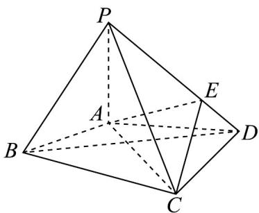
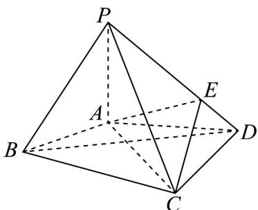
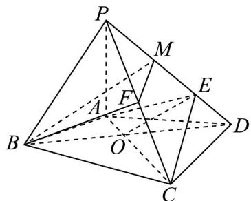

> [!faq]- 《专题03空间向量的应用四大常考题型_高效培优专项训练_》官方解析
>
> > [!success]- **【答案】** A
>
> > [!note]- **【分析】**
> > 由 $l//\alpha$ ，有 $a\perp n$ ，结合空间向量垂直的坐标表示列方程求参数值。
>
> > [!note]- **【解析】**
> > 由 $l//\alpha$ ，则 $a\perp n$ ，即 $a\cdot n=-4+\lambda-1=0$ ，可得 $\lambda=5$ 。
> >
> > 故选：A
> >
> > 8. 刻画空间的弯曲性是几何研究的重要内容·用曲率刻画空间弯曲性，规定：多面体顶点的曲率等于 $2\pi$ 与多面体在该点的面角之和的差（多面体的面的内角叫做多面体的面角，角度用弧度制），例如：正方体在每个顶点有 $^{3}$ 个面角，每个面角是 $\frac{\pi}{2}$ ，所以正方体在各顶点的曲率为 $2\pi - 3 \times \frac{\pi}{2} = \frac{\pi}{2}$ ·已知四棱锥 $P - ABCD$ 在点 $A$ 的曲率为 $\frac{\pi}{3}$ ，且 $PB = PD, CB = CD, PA = AB = AD = \frac{\sqrt{3}}{3} BD = 2$ .
> >
> > 
> >
> > (1)若点 $_{B}$ 的曲率为 $\frac{3\pi}{4},\angle PBC=\angle ABC$ ，求四棱锥P-ABCD的表面积；
> >
> > (2)若点 $E$ 在 $PD$ 上，且 $PE:ED = 2:1$ ·试探究：在棱 $PC$ 上是否存在点 $F$ ，使 $BF //$ 平面 $AEC$ ？证明你的结论·
> >
> > 【答案】(1) $4\sqrt{3}+4\sqrt{6}+4$
> >
> > (2)存在，证明见解析·
> >
> > 【分析】(1)利用曲率可求出相应的角，从而可计算各表面面积；
> >
> > (2)利用中位线来证明线线平行，再证明线面平行和面面平行，最后问题得证·
> >
> > 【详解】（1）
> >
> > 
> >
> > 由 $PA = AB = AD = \frac{\sqrt{3}}{3} BD = 2$ ，利用余弦定理可得： $\cos \angle BAD = \frac{4 + 4 - 12}{2\times 2\times 2} = -\frac{1}{2}$ 由 $\angle BAD\in (0,\pi)$ 可得： $\angle BAD = \frac{2\pi}{3}$ ，利用内角和定理可得 $\angle ABD = \frac{\pi}{6}$
> >
> > 此时 $S_{\triangle ABD} = \frac{1}{2}\times 2\times 2\times \sin \frac{2\pi}{3} = \sqrt{3}$
> >
> > 又因为 $PB = PD, PA = AB = AD$ ，所以 $\triangle PAD \cong \triangle PAB$
> >
> > 即 $\angle PAD = \angle PAB$
> >
> > 根据四棱锥 P-ABCD 在点 A 的曲率为 $\frac{\pi}{3}$ ，
> >
> > 可得 $\angle PAD = \angle PAB = \frac{1}{2}\left(2\pi -\frac{\pi}{3} -\frac{2\pi}{3}\right) = \frac{\pi}{2}$ ，利用内角和定理可得 $\angle ABP = \frac{\pi}{4}$ 此时 $S_{\triangle PAB} = S_{\triangle PAD} = \frac{1}{2}\times 2\times 2 = 2$ 再由点 $B$ 的曲率为 $\frac{3\pi}{4},\angle PBC = \angle ABC$ 可得 $\angle PBC = \angle ABC = \frac{1}{2}\left(2\pi -\frac{3\pi}{4} -\frac{\pi}{4}\right) = \frac{\pi}{2}$ 因为 $\angle ABD = \frac{\pi}{6}$ ，所以 $\angle CBD = \frac{\pi}{3}$ ，又因为 $CB = CD$ ，所以三角形CBD是等边三角形，此时 $S_{\triangle BCD} = \frac{1}{2}\times 2\sqrt{3}\times 2\sqrt{3}\times \sin \frac{\pi}{3} = 3\sqrt{3}$ ，由于 $CB = 2\sqrt{3}$ 所以 $S_{\triangle PBC} = \frac{1}{2}\times 2\sqrt{3}\times 2\sqrt{2} = 2\sqrt{6}$ 利用 $\triangle PBC\cong \triangle PDC$ 可知 $S_{\triangle PDC} = \frac{1}{2}\times 2\sqrt{3}\times 2\sqrt{2} = 2\sqrt{6}$ 所以四棱锥 $P - ABCD$ 的表面积为 $\sqrt{3} +3\sqrt{3} +2\times 2 + 2\times 2\sqrt{6} = 4\sqrt{3} +4\sqrt{6} +4$
> >
> > 
> >
> > 取 M, F 分别为 PE, PC 的中点， $AC \cap BD = O$ ，连接 OE, BM, MF, BF 利用中位线可知 $MF // CE$ ，
> > 又由 CB = CD, AB = AD，可得 $\triangle ABC \cong \triangle ADC$ ，即 $\angle BAC = \angle DAC$ ，
> > 又可证得 $\triangle ABO \cong \triangle ADO$ ，即 BO = OD，又因为 E 为 MD 中点，
> > 所以 OE // BM，又因为 OE ⊂ 平面 AEC，BM ∉ 平面 AEC，
> > 所以 BM // 平面 AEC，同理由 MF // CE，可证明 MF // 平面 AEC，
> > 又因为 BM ∩ MF = M，BM, MF ⊂ 平面 BMF，
> > 所以平面 BMF // 平面 AEC，
> >
> > 又因为 $BF \subset$ 平面 $BMF$ ，所以 $BF //$ 平面 $AEC$
> >
> > 此时 F 为 PC 的中点·
