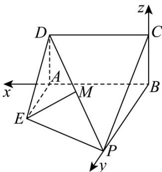

> [!faq]- 《专题03空间向量的应用四大常考题型_高效培优专项训练_》官方解析
>
> > [!success]- **【答案】** 证明见解析
>
> > [!note]- **【分析】**
> > 利用勾股定理逆定理先判定 $AD \perp AE$ ，建立合适的空间直角坐标系，利用空间向量研究线面关系即可·
>
> > [!note]- **【解析】**
> > 由已知 $AD = AE = 1$ ， $DE = \sqrt{2}$
> >
> > 可知 $DE^{2} = AE^{2} + AD^{2}$ ，则 $AD\bot AE$
> >
> > 又矩形ABCD中有 $AD \perp AB$ ，且 $AE \perp AB$
> >
> > $AE \cap AB = A, AE, AB \subset$ 平面 $ABEP$
> >
> > 所以 $AD \perp$ 平面 ABEP ，
> >
> > 又 $BC \parallel AD$
> >
> > 则 $BC \perp$ 平面 ABEP ，
> >
> > 所以 $BA, BP, BC$ 两两垂直，
> >
> > 故以 B 为原点， $BA, BP, BC$ 分别为 x 轴，y 轴，z 轴正方向，
> >
> > 建立如图所示的空间直角坐标系，
> >
> > 
> >
> > 则 $P(0,2,0),D(2,0,1),M\left(1,1,\frac{1}{2}\right),E(2,1,0),C(0,0,1)$
> >
> > 所以 $EM = \left(-1, 0, \frac{1}{2}\right)$ .
> >
> > 易知平面ABCD的一个法向量等于 $n = (0,1,0)$
> >
> > 所以 $EM \cdot n = -1 \times 0 + 0 \times 1 + \frac{1}{2} \times 0 = 0$
> >
> > 所以 $EM \perp n$
> >
> > 又 EM ∉ 平面 ABCD，
> >
> > 所以 $EM \parallel$ 平面ABCD.
