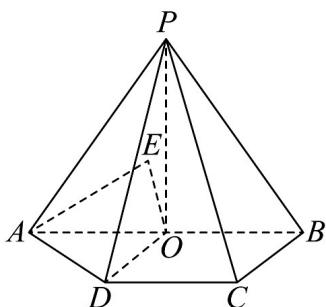

<!-- question-source:start -->
28. 如图，在四棱锥 $P - ABCD$ 中，平面 $PAB \perp$ 平面 $ABCD$ ，底面 $ABCD$ 为直角梯形，

$$
\angle A B C = \angle B C D = 9 0 ^ {\circ}, P A = P B = A B = 2
$$

$$
D C = B C = 1
$$

$$
o
$$

$$
D O / / B C
$$

连 $PO$ 设点 $E$ 是平面 $POD$ 上的动点，若直线 $AE$ 与平面 $PBC$ 所成的角为 $\frac{\pi}{6}$ ，则 $OE$ 的最小值为（）

A. 2 B. $\sqrt{2}$ C. $\frac{1}{3}$ D. $\frac{\sqrt{3}}{3}$
<!-- question-source:end -->

![[高中/课堂同步/题库/人教A版高中数学同步讲义(2026)/03_选择性必修第一册/第一章 空间向量与立体几何/专项训练/专题03空间向量的应用四大常考题型_高效培优专项训练_/题型三_sec_04/questions/answers/Q00062728A1.md]]
