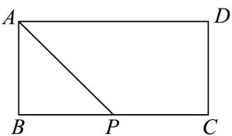
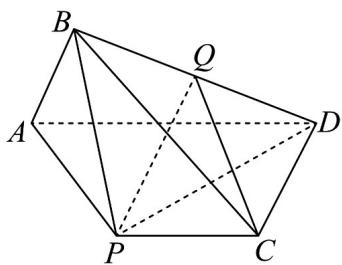

<!-- question-source:start -->
30. 如图 1，在矩形 ABCD 中，AD = 2AB = 2，P 是 BC 的中点，连接 AP，将 $\triangle PAB$ 沿直线 AP 翻折，使得平面 $PAB \perp$ 平面 APCD（如图 2），连接 BC，BD，Q 是棱 BD 的中点。

图1
图2

(1)证明： $AB\perp$ 平面PBD；

(2)证明： $CQ / /$ 平面 $PAB$ ；

(3)求直线 PQ 和平面 PBC 所成角的正弦值.
<!-- question-source:end -->

![[高中/课堂同步/题库/人教A版高中数学同步讲义(2026)/03_选择性必修第一册/第一章 空间向量与立体几何/专项训练/专题03空间向量的应用四大常考题型_高效培优专项训练_/题型三_sec_04/questions/answers/Q00062730A1.md]]
