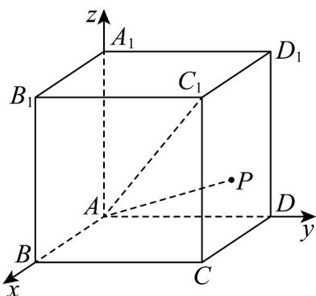

> [!faq]- 《专题03空间向量的应用四大常考题型_高效培优专项训练_》官方解析
>
> > [!success]- **【答案】** A
>
> > [!note]- **【分析】**
> > 建立空间直角坐标系得出相关点的坐标，设 $P(x,y,z)$ ，根据已知以及线面角的坐标表示得出 $x = y = z$ 。进而分六个面依次讨论，即可得出点 $P$ 坐标·进而根据线线角的坐标求解即可得出答案。
>
> > [!note]- **【解析】**
> > 
> >
> > 如图，以点 A 为坐标原点建立空间直角坐标系，则
> >
> > $A(0,0,0)$ ， $C_{1}(2,2,4)$ ，设 $P(x,y,z)$ ，则 $\overline{AP}=(x,y,z)$
> >
> > 易知平面 ABCD 一个法向量为 $\stackrel{\cup}{n}_{1} = (0, 0, 1)$ ，平面 $ABB_{1}A_{1}$ 的一个法向量为 $\stackrel{\square\square}{n}_{2} = (0, 1, 0)$ ，平面 $ADD_{1}A_{1}$ 的一个法向量为 $\stackrel{\square\square}{n}_{3} = (1, 0, 0)$ ，
> >
> > 设直线 $AP$ 与平面 $ABCD$ 、平面 $ABB_{1}A_{1}$ 、平面 $ADD_{1}A_{1}$ 所成的角分别为 $\theta_{1},\theta_{2},\theta_{3}$
> >
> > 由已知可得 $\theta_{1}=\theta_{2}=\theta_{3}$ .
> >
> > 又 $\sin\theta_{1}=\left|\frac{\square\square\square\square}{\left|AP\right|\cdot\left|n_{1}\right|}\right|=\frac{\left|z\right|}{\left|AP\right|},\quad\sin\theta_{2}=\left|\frac{\square\square\square\square}{\left|AP\right|\cdot\left|n_{2}\right|}\right|=\frac{\left|y\right|}{\left|AP\right|},\quad\sin\theta_{3}=\left|\frac{\square\square\square\square}{\left|AP\right|\cdot\left|n_{3}\right|}\right|=\frac{\left|x\right|}{\left|AP\right|},$
> >
> > 所以有 $|x| = |y| = |z|$ .
> >
> > 又由 P 是正四棱柱 $ABCD - A_{1}B_{1}C_{1}D_{1}$ 表面上的一个动点，易知 x = y = z ，所以 x = y = z 。
> >
> > 若 $P$ 是平面ABCD上的一个动点，可知 $z = 0$ ， $0 \leq x \leq 2$ ， $0 \leq y \leq 2$ ，满足条件的点的坐标为 $(0,0,0)$ ，与点A重合，舍去；
> >
> > 若 $P$ 是平面 $ABB_{1}A_{1}$ 上的一个动点，可知 $y = 0$ ， $0 \leq x \leq 2$ ， $0 \leq z \leq 4$ ，满足条件的点的坐标为 $(0,0,0)$ ，与点A重合，舍去；
> >
> > 若 $P$ 是平面 $ADD_{1}A_{1}$ 上的一个动点，可知 $x = 0$ ， $0 \leq y \leq 2$ ， $0 \leq z \leq 4$ ，满足条件的点的坐标为 $(0,0,0)$ ，与点A重合，舍去；
> >
> > 若 $P$ 是平面 $CDD_{1}C_{1}$ 上的一个动点，可知 $y = 2$ ， $0 \leq x \leq 2$ ， $0 \leq z \leq 4$ ，满足条件的点的坐标为 $(2,2,2)$ ，点 $P$ 可以为 $(2,2,2)$ ；
> >
> > 若 $P$ 是平面 $A_{1}B_{1}C_{1}D_{1}$ 上的一个动点，可知 $z = 4$ ， $0 \leq x \leq 2$ ， $0 \leq y \leq 2$ ，没有满足条件的点；
> >
> > 若 $P$ 是平面 $BCC_{1}B_{1}$ 上的一个动点，可知 $x = 2$ ， $0 \leq y \leq 2$ ， $0 \leq z \leq 4$ ，满足条件的点的坐标为 $(2,2,2)$ ，重
> >
> > 复舍去·
> >
> > 综上所述， $P(2,2,2)$ .
> >
> > 所以 $AP = (2, 2, 2)$ .
> >
> > 又 $AC_{1} = (2,2,4)$
> >
> > 所以，与 $AC_{1}$ 所成角的余弦值为 $\left|\frac{AP\cdot AC_{2}}{|AP|\cdot|AC_{1}}\right| = \left|\frac{2\times 2 + 2\times 2 + 2\times 4}{\sqrt{2^2 + 2^2 + 2^2}\times\sqrt{2^2 + 2^2 + 4^2}}\right| = \frac{2\sqrt{2}}{3}.$
> >
> > 故选 **A**.
