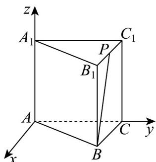
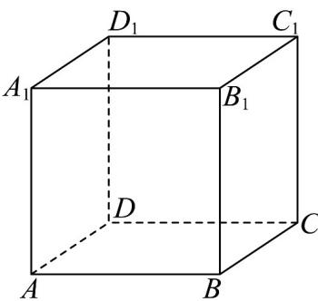
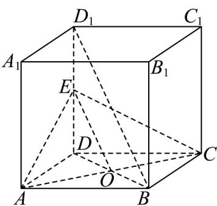
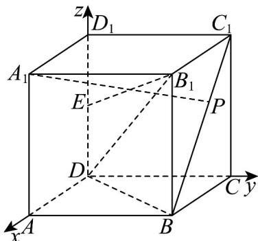

> [!faq]- 《专题03空间向量的应用四大常考题型_高效培优专项训练_》官方解析
>
> > [!success]- **【答案】** A
>
> > [!note]- **【分析】**
> > 如图，过点A作平面 $ACC_{1}A_{1}$ 的垂线为x轴，以AC， $AA_{1}$ 为y轴和z轴，作空间直角坐标系·求平面 $ACC_{1}A_{1}$ 的一个法向量n，以及直线BP的方向向量 $\overline{BP}$ ，则 $\left|\cos n,\overline{BP}\right|$ 即为所求·
>
> > [!note]- **【解析】**
> > 如图，过点 A 作平面 $ACC_{1}A_{1}$ 的垂线为 x 轴，以 AC， $AA_{1}$ 为 y 轴和 z 轴，作空间直角坐标系。
> >
> > 
> >
> > 则平面 $ACC_{1}A_{1}$ 的一个法向量为 $n = (1,0,0)$
> >
> > 设正三棱柱 $ABC - A_{1}B_{1}C_{1}$ 中， $AB = AA_{1} = 2$ ，则 $B(\sqrt{3}, 1, 0)$ ， $P\left(\frac{\sqrt{3}}{2}, \frac{3}{2}, 2\right)$
> >
> > 所以 $\overrightarrow{BP}=\left(-\frac{\sqrt{3}}{2},\frac{1}{2},2\right)$ ，所以 $\cos n,\overrightarrow{BP}=\frac{\overrightarrow{n}\cdot\overrightarrow{BP}}{\left|\overrightarrow{n}\right|\cdot\left|\overrightarrow{BP}\right|}=\frac{-\frac{\sqrt{3}}{2}}{1\times\sqrt{5}}=-\frac{\sqrt{15}}{10}$
> >
> > 所以直线 $BP$ 与平面 $ACC_{1}A_{1}$ 所成角的正弦值为 $\left|\cos n, BP\right| = \frac{\sqrt{15}}{10}$ .
> >
> > 故选：A
> >
> > 25. 正方体 $ABCD - A_{1}B_{1}C_{1}D_{1}$ 的棱长为 1， $E$ 为棱 $DD_{1}$ 的中点，点 $P$ 在面对角线 $BC_{1}$ 上运动（ $P$ 点异于 $B$ 、 $C_{1}$ 点），以下说法错误的是（）
> >
> > 
> >
> > A. $BD_{1} / /$ 平面 $AEC$
> >
> > B $A_{1}P\perp B_{1}D$
> >
> > C. 直线 $B_{1}E$ 与平面 $CDD_{1}C_{1}$ 所成角的余弦值为 $\frac{2}{3}$
> >
> > D．三棱锥 $P - ACD_{1}$ 的体积为 $\frac{1}{6}$
> >
> > 【答案】C
> >
> > 【分析】根据线面平行的判定定理可证明 A 选项正确；应用空间向量计算数量积，可判断 B 正确；根据线面角的计算，可得 C 选项错误；应用空间向量法可求得点到平面距离，再结合三棱锥的体积公式，计算可得 D 正确。
> >
> > 【详解】对于 $^{A}$ ，连接BD、AC，相交于点O，连接OE，如图所示，
> >
> > 
> >
> > 因为四边形ABCD为正方形，所以 $O$ 是BD中点，
> >
> > 又 $E$ 为棱 $DD_{1}$ 的中点，所以 $OE // BD_{1}$
> >
> > 又 $OE \subset$ 平面 AEC， $BD_{1} \notin$ 平面 AEC，所以 $BD_{1} //$ 平面 AEC，故 A 正确；
> >
> > 对于 B，以 D 为原点，以 DA、DC、 $DD_{1}$ 为 x 轴、y 轴、z 轴，建立空间直角坐标系，如图所示，设 $BP = \lambda BC$ ，则 $A_{1}(1,0,1)$ ， $B_{1}(1,1,1)$ ， $D(0,0,0)$ ， $P(1-\lambda,1,\lambda)$ ，
> >
> > 所以 $\overline{B}_{1}D=\left(-1,-1,-1\right),\overline{A}_{1}P=\left(-\lambda,1,\lambda-1\right)$ ， $A_{1}P\cdot B_{1}D=\left(-1\right)\times\left(-\lambda\right)+\left(-1\right)\times1+\left(-1\right)\times\left(\lambda-1\right)=0$ ，所以 $A_{1}P \perp B_{1}D$ ，故 B 正确；
> >
> > 
> >
> > 对于 C，由 B 选项知， $A(1,0,0)$ ， $E\left(0,0,\frac{1}{2}\right)$ ，所以 $B_{1}E=\left(-1,-1,-\frac{1}{2}\right)$
> >
> > 因为 $DA \perp$ 平面 $CDD_{1}C_{1}$ ，所以平面 $CDD_{1}C_{1}$ 的法向量为 $\overline{DA} = (1,0,0)$
> >
> > 设直线 $B_{1}E$ 与平面 $CDD_{1}C_{1}$ 所成角为 $\theta$
> >
> > 所以 $\sin\theta=\frac{\left|\overrightarrow{DA}\cdot\overrightarrow{B_{1}E}\right|}{\left|DA\right|\cdot\left|B_{1}E\right|}=\frac{2}{3}$ ，所以 $\cos\theta=\sqrt{1-\sin^{2}\theta}=\frac{\sqrt{5}}{3}$ ，故 C 错误；
> >
> > 对于 $\mathsf{D}$ ，因为 $P(1 - \lambda ,1,\lambda)$ ， $A(1,0,0)$ ， $C(0,1,0)$ ， $D_{1}(0,0,1)$
> >
> > 则 $\overline{AP} = (-\lambda, 1, \lambda)$ ， $\overline{AC} = (-1, 1, 0)$ ， $\overline{CD}_1 = (0, -1, 1)$
> >
> > 设平面 $ACD_{1}$ 的法向量为 $m = (x, y, z)$ ,
> >
> > 则 $\left\{ \begin{array}{l}m\cdot AC = 0\\ \rightarrow \\ m\cdot CD_1 = 0 \end{array} \right.$ ，即 $\left\{ \begin{array}{ll} - x + y = 0\\ -y + z = 0 \end{array} \right.$ ，解得 $m = (1,1,1)$
> >
> > 因为 $AC = AD_{1} = CD_{1} = \sqrt{2}$ ，所以 $S_{\triangle ACD_{1}} = \frac{1}{2} \times \sqrt{2} \times \sqrt{2} \times \frac{\sqrt{3}}{2} = \frac{\sqrt{3}}{2}$ ，
> >
> > 点 $_{P}$ 到平面 $ACD_{1}$ 的距离为 $h=\frac{AP\cdot m}{|m|}=\frac{-\lambda+1+\lambda}{\sqrt{3}}=\frac{\sqrt{3}}{3}$ ，
> >
> > 所以三棱锥 $P-ACD_{1}$ 的体积为 $V_{P-ACD_{1}}=\frac{1}{3}\times\frac{\sqrt{3}}{2}\times\frac{\sqrt{3}}{3}=\frac{1}{6}$ ，故 D 正确.
> >
> > 故选 **C**.
