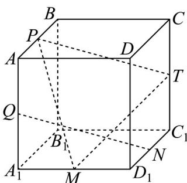

<!-- question-source:start -->
14．如图，在正方体 $ABCD-A_{1}B_{1}C_{1}D_{1}$ 中，点 P, Q, M, N, T 分别为所在棱的中点，则（）

A. $QN \perp BB_{1}$

$$
Q N / /
$$

$$
B C C _ {1} B _ {1}
$$

C. 直线 $QN$ 与 $PT$ 为异面直线 D. $B_{1}D \perp$ 平面 PMT
<!-- question-source:end -->

![[高中/课堂同步/题库/人教A版高中数学同步讲义(2026)/03_选择性必修第一册/第一章 空间向量与立体几何/专项训练/专题03空间向量的应用四大常考题型_高效培优专项训练_/题型二_sec_03/questions/answers/Q00062717A1.md]]
