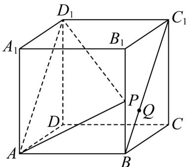

<!-- question-source:start -->
15. 如图，在棱长为 $^{2}$ 的正方体 $ABCD-A_{1}B_{1}C_{1}D_{1}$ 中， $\overline{BP}=\lambda\overline{BB}_{1}$ ， $\overline{BQ}=\mu BC_{1}$ ， $\lambda$ ， $\mu\in(0,1)$ ，则下列说法错误的是（）

A. 当 $\lambda = \mu$ 时， $B_{1}C_{1} //$ 平面 $D_{1}PQ$ B. 当 $\lambda = \frac{1}{2}$ 时，四面体 $APQD_{1}$ 的体积为定值

C. 当 $\mu = \frac{1}{2}$ 时， $\exists \lambda \in (0,1)$ ，使得 $A_{1}Q \perp$ 平面 $D_{1}PA$ D. 三棱锥 $P-CBD$ 体积的取值范围为 $\left(0, \frac{4}{3}\right)$
<!-- question-source:end -->

![[高中/课堂同步/题库/人教A版高中数学同步讲义(2026)/03_选择性必修第一册/第一章 空间向量与立体几何/专项训练/专题03空间向量的应用四大常考题型_高效培优专项训练_/题型二_sec_03/questions/answers/Q00062718A1.md]]
