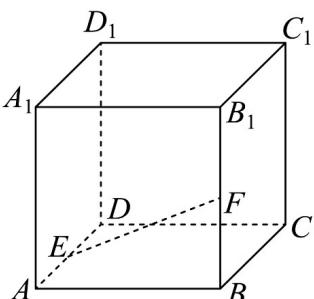

<!-- question-source:start -->
17. 在棱长为 $^{2}$ 的正方体 $ABCD - AB_{1}C_{1}D_{1}$ 中，点E,F分别为棱 $AD,BB_{1}$ 的中点·点P为正方体表面上的动点，满足 $A_{1}P \perp EF$ ·给出下列四个结论，不正确的是（）

A．存在点P，使得 $\left|A_{1}P\right|=2\sqrt{3}$ B．存在点P，使得 $A_{1}P\perp$ 平面ADF
C．存在点P，使得DP//EF
D．存在点P，使得 $B_{1}P=DP$
<!-- question-source:end -->

![[高中/课堂同步/题库/人教A版高中数学同步讲义(2026)/03_选择性必修第一册/第一章 空间向量与立体几何/专项训练/专题03空间向量的应用四大常考题型_高效培优专项训练_/题型二_sec_03/questions/answers/Q00062719A1.md]]
