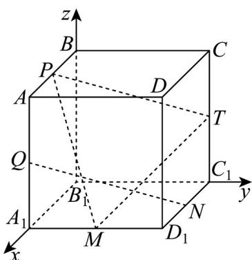

> [!faq]- 《专题03空间向量的应用四大常考题型_高效培优专项训练_》官方解析
>
> > [!success]- **【答案】** D
>
> > [!note]- **【分析】**
> > 首先以点 $B_{1}$ 为原点建立空间直角坐标系，利用向量法，判断垂直和平行关系·
>
> > [!note]- **【解析】**
> > 如图，建立空间直角坐标系，设棱长为2
> >
> > A. $Q(2,0,1)$ , $N(1,2,0)$ , $B(0,0,2)$ , $B_1(0,0,0)$ , $QN = (-1,2,-1)$ , $BB_1 = (0,0,-2)$
> >
> > $QN \cdot BB_{1} = 2 \neq 0$ ，所以 $QN$ 与 $BB_{1}$ 不垂直，故 $A$ 错误；
> >
> > B. 平面 $BCC_{1}B_{1}$ 的法向量为 $\overline{B_{1}A_{1}}=(2,0,0)$ ， $QN\cdot B_{1}A_{1}=-2\neq0$ ，所以 QN 与平面 $BCC_{1}B_{1}$ 的法向量不垂直，则 QN 与平面 $BCC_{1}B_{1}$ 不平行，故 B 错误；
> >
> > C. $P(1,0,2)$ , $T(0,2,1)$ , $\overline{PT} = (-1,2,-1)$ , $\overline{QN} = (-1,2,-1)$ , 所以 $\overline{PT} = \overline{QN}$ , 则 $PT \parallel QN$ , 故 C 错误;
> > D. $D(2,2,2)$ , $M(2,1,0)$ , $B_{1}D = (2,2,2)$ , $PM = (1,1,-2)$ , $B_{1}D \cdot PM = 0$ ,
> >
> > $\stackrel{\square\square\square}{PT}=\left(-1,2,-1\right)$ ， $B_{1}D\cdot PT=0$ ， $PM\cap PT=P$ ， $PM,PT\subset$ 平面PMT，所以 $B_{1}D\perp$ 平面PMT，故 $^{D}$ 正确·
> >
> > 
> >
> > 故选 **D**
