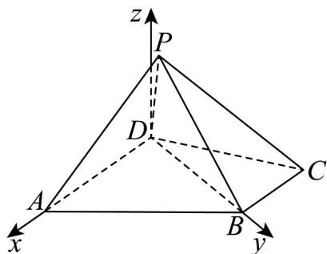

> [!faq]- 《专题03空间向量的应用四大常考题型_高效培优专项训练_》官方解析
>
> > [!success]- **【答案】** (1)证明见详解； (2) $(0,\sqrt{3})\cup(3,2\sqrt{3})$ .
>
> > [!note]- **【分析】**
> > （1）通过证明 $PB$ 垂直平面 $PAD$ 与平面 $PBC$ 的交线，利用平面与平面垂直的性质定理来证明线面垂直，再利用线面垂直的性质定理证得两直线垂直；
> >
> > (2) 建立空间直角坐标系，将垂直关系、线段长度都转化成坐标运算，设 $P(a, b, c)$ ，通过 $PA \perp PC$ 解得 $a = 2$ 或 $-1$ ，分别代入计算可得结果。
>
> > [!note]- **【解析】**
> > （1）设平面 $ADP \cap$ 平面 $BCP = l$ ，
> >
> > ∵ BC ∥ AD, AD ⊂ 平面 ADP, BC ∉ 平面 ADP，∴ BC ∥ 平面 ADP
> >
> > 又∵ $BC \subset$ 平面 $BCP$ ，平面 $ADP \cap$ 平面 $BCP = l$ ，∴ $BC \parallel l$
> >
> > $$
> > \because P B \perp B C, B C \parallel l, \therefore P B \perp l
> > $$
> >
> > 又∵平面 $ADP \perp$ 平面 BCP，平面 $ADP \cap$ 平面 $BCP = l, PB \subset$ 平面 BCP，
> >
> > $\therefore PB \perp$ 平面 ADP.
> >
> > 又∵ $AP \subset$ 平面 ADP ，
> >
> > $\therefore PB \perp AP$ 即 $AP \perp BP$ .
> >
> > (2) 在 $\triangle BCD$ 中由余弦定理可得 $BD = \sqrt{3}$ ，则有 $BD^2 + BC^2 = CD^2$
> >
> > $\therefore \angle CBD = \frac{\pi}{2}$ , 即 $DB \perp BC$ .
> >
> > 又∵ BC // AD, ∴ DB ⊥ AD.
> >
> > 以点 $D$ 为原点，以 $DA, DB$ ，平面ABCD的垂线所在直线分别为 $x, y, z$ 轴，建立如图坐标系，则 $A(2,0,0),B(0,\sqrt{3},0),C(-1,\sqrt{3},0)$
> >
> > 
> >
> > 设 $P(a,b,c)$ ，则 $\overline{DP} = (a,b,c),\overline{DA} = (2,0,0)$
> >
> > 设平面 PAD 的一个法向量为 $n_{1}=(x,y,z)$ ,
> >
> > 则 $\left\{ \begin{array}{l} \square \\ n_1 \cdot DA = 0 \\ \square \\ n_1 \cdot DP = 0 \end{array} \right.$ ，即 $\left\{ \begin{array}{l} 2x = 0 \\ ax + by + cz = 0 \end{array} \right.$ ，令 $y = c$ ，则 $\square$ $n_1 = (0, c, -b)$ .
> >
> > 同理可求平面 $PBC$ 的一个法向量为 $\overline{n_2} = (0, c, \sqrt{3} - b)$
> >
> > 由于平面 $PAD \perp$ 平面 PBC ，则 $n_{1} \cdot n_{2} = 0$ ，故 $c^{2} + b(b - \sqrt{3}) = 0$ ，则 $b \in (0, \sqrt{3})$ .
> >
> > 又∵ $PA \perp PC$ ， $\overline{PA} = (2 - a, -b, -c)$ ， $\overline{PC} = (-1 - a, \sqrt{3} - b, -c)$ ，
> >
> > $\therefore PA \cdot PC = (a - 2)(a + 1) + b(b - \sqrt{3}) + c^{2} = 0$ ，解得 a = 2 或 -1.
> >
> > 若 a=2 ，则 $PA=\sqrt{b^{2}+c^{2}}=\sqrt{\sqrt{3}b}\in(0,\sqrt{3})$ ;
> >
> > 若 a = -1 ，则 $PA = \sqrt{9 + b^{2} + c^{2}} = \sqrt{9 + \sqrt{3}b} \in (3, 2\sqrt{3})$ .
> >
> > 综上所述，PA 长度的取值范围 $\left(0,\sqrt{3}\right)\cup\left(3,2\sqrt{3}\right)$ .
