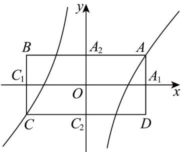

<!-- question-source:start -->
32. 如图， $f(x)=x-\frac{1}{x}$ 图象上两点 A, C 关于原点对称，点 A 的横坐标 $x_{0}=\sqrt{2}$ ，过点 A, C 分别作两坐标轴的垂线得到矩形 ABCD，矩形与坐标轴的交点分别记为 $A_{1}, A_{2}, C_{1}, C_{2}$ 。将图象沿 x 轴折叠，得到一个二面角

$A - A_{1}C_{1} - C$ ，若 $\left|AC\right| = \frac{\sqrt{34}}{2}$ ，则二面角 $A - A_{1}C_{1} - C$ 的大小为（）

A. $30^{\circ}$ B. $60^{\circ}$ C. $120^{\circ}$ D. $150^{\circ}$
<!-- question-source:end -->

![[高中/课堂同步/题库/人教A版高中数学同步讲义(2026)/03_选择性必修第一册/第一章 空间向量与立体几何/专项训练/专题03空间向量的应用四大常考题型_高效培优专项训练_/题型四_sec_05/questions/answers/Q00062732A1.md]]
