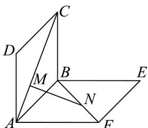

<!-- question-source:start -->
33. 如图所示，正方形 $ABCD$ ， $ABEF$ 的边长都是 1，且它们所在的平面互相垂直。动点 $M$ ， $N$ 分别在正方形对角线 $AC$ 和 $BF$ 上移动，且 $CM = BN$ 。当 $MN$ 的长最小时，二面角 $A - MN - B$ 的平面角的余弦值为（）

<!-- question-source:end -->

![[高中/课堂同步/题库/人教A版高中数学同步讲义(2026)/03_选择性必修第一册/第一章 空间向量与立体几何/专项训练/专题03空间向量的应用四大常考题型_高效培优专项训练_/题型四_sec_05/questions/answers/Q00062733A1.md]]
