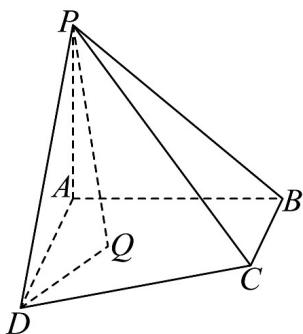

<!-- question-source:start -->
34. 如图，在四棱锥 $P - ABCD$ 中，已知： $PA \perp$ 平面 $ABCD$ ， $\angle BAD = 90^{\circ}$ ， $BC // AD$ ，

$PA = AB = BC = \frac{1}{2} AD = 2$ ，已知 $Q$ 是四边形ABCD内部一点（包括边界），且二面角 $Q - PD - A$ 的平面角大小为 $\frac{\pi}{3}$ ，则线段 $AQ$ 长度的最小值是（）

A. $\sqrt{6}$ B. 2 C. $\frac{4\sqrt{15 - 3\sqrt{15}}}{3}$ D. 4
<!-- question-source:end -->

![[高中/课堂同步/题库/人教A版高中数学同步讲义(2026)/03_选择性必修第一册/第一章 空间向量与立体几何/专项训练/专题03空间向量的应用四大常考题型_高效培优专项训练_/题型四_sec_05/questions/answers/Q00062734A1.md]]
