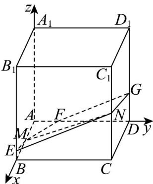
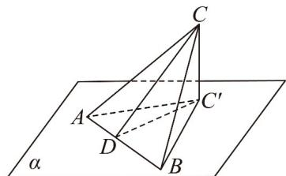

> [!faq]- 《专题03空间向量的应用四大常考题型_高效培优专项训练_》官方解析
>
> > [!success]- **【答案】** B
>
> > [!note]- **【分析】**
> > 以点A为坐标原点，AB、AD、 $AA_{1}$ 所在直线分别为x、y、z轴建立空间直角坐标系，设平面 $\alpha$ 交直线 $AA_{1}$ 于点 $P(0,0,a)$ ，利用空间向量法可求出平面 $\alpha$ 与平面ABCD的所成角为最小时a的值，求出此时二面角余弦值的最大值，然后利用射影面积法可求出截面 $\Gamma$ 的面积.
>
> > [!note]- **【解析】**
> > 以点A为坐标原点，AB、AD、 $AA_{1}$ 所在直线分别为x、y、z轴建立如下图所示的空间直角坐标系，
> >
> > 
> >
> > 则 $M(2,0,0)$ 、 $N(4,4,2)$ ，设平面 $\alpha$ 交直线 $AA_{1}$ 于点 $P(0,0,a)$
> >
> > $$
> > M N = (2, 4, 2)
> > $$
> >
> > $$
> > M P = (- 2, 0, a)
> > $$
> >
> > 设平面 $\alpha$ 的一个法向量为 $m = (x,y,z)$ ，则 $\left\{ \begin{array}{l} m \cdot MN = 2x + 4y + 2z = 0 \\ \rightarrow \square \square \\ m \cdot MP = -2x + az = 0 \end{array} \right.$
> >
> > 取 $x = 2a$ ，可得 $m = (2a, - a - 2,4)$
> >
> > 易知平面 ABCD 的一个法向量为 $n = (0, 0, 1)$ ,
> >
> > 设平面 $\alpha$ 与平面 $ABCD$ 的所成角为 $\theta$
> >
> > $$
> > \cos \theta = \left| \cos \stackrel {\rightarrow} {m}, n \right| = \frac {\left| \stackrel {m} {\rightarrow} \cdot n \right|}{\left| m \right| \cdot \left| n \right|} = \frac {4}{\sqrt {4 a ^ {2} + (- a - 2) ^ {2} + 1 6}} = \frac {4}{\sqrt {5 a ^ {2} + 4 a + 2 0}}
> > $$
> >
> > 当且仅当 $a = -\frac{2}{5}$ 时， $\cos\theta$ 取最大值 $\frac{\sqrt{30}}{6}$ ，此时平面 $\alpha$ 与平面 ABCD 所成角最小，
> >
> > 则 $\vec{m}=\left(-\frac{4}{5},-\frac{8}{5},4\right)$ ,
> >
> > 设平面 $\alpha$ 交棱 $BB_{1}$ 于点 $F(0,b,0)$ ， $\overline{MF} = (-2,b,0)$
> >
> > 因为 $MF \subset \alpha$ ，则 $\overline{MF} \cdot m = \frac{8}{5} - \frac{8}{5} b = 0$ ，解得 $b = 1$ ，即点 $F(0,1,0)$ ，
> >
> > 结合图形可知，平面 $\alpha$ 分别交棱 $BB_{1}$ 、 $DD_{1}$ 于点 E、G，
> >
> > 先证明射影面积法：设点 C 在平面 $\alpha$ 内的射影点为 $C'$ ，如下图所示：
> >
> > 
> >
> > 过点 C 在平面 ABC 内作 $CD \perp AB$ ，连接 $C'D$
> >
> > 因为 $CC' \perp$ 平面 $ABC'$ ， $AB \subset$ 平面 $ABC'$ ，所以 $CC' \perp AB$
> >
> > 因为 $CD \perp AB$ ， $CC' \cap CD = C$ ， $CC'$ 、 $CD \subset$ 平面 $CC'D$ ，故 $AB \perp$ 平面 $CC'D$
> >
> > 因为 $C^{\prime}D\subset$ 平面 $CC^{\prime}D$ ，所以 $C^{\prime}D\bot AB$
> >
> > 故 $\angle CDC'$ 为锐二面角 $C - AB - C'$ 的平面角，
> >
> > 在中， $\cos \angle CDC' = \frac{C'D}{CD} = \frac{\frac{1}{2} C'D \cdot AB}{\frac{1}{2} CD \cdot AB} = \frac{S_{\triangle ABC'}}{S_{\triangle ABC}}$
> >
> > 推广到其他多边形的面积也成立，
> >
> > 本题中， $S_{多边形BCDFM}=S_{\square ABCD}-S_{\triangle AFM}=4^{2}-\frac{1}{2}\times2\times1=15$
> >
> > 设截面 $\Gamma$ 的面积为 S，由射影面积法可得 $\frac{S_{多边形BCDFM}}{S} = \cos \theta = \frac{\sqrt{30}}{6}$ ，
> >
> > 故 $S = S_{\text{多边形}BCDFM}\cdot \frac{\sqrt{30}}{5} = 15\times \frac{\sqrt{30}}{5} = 3\sqrt{30}.$
> >
> > 故选 **B**.
