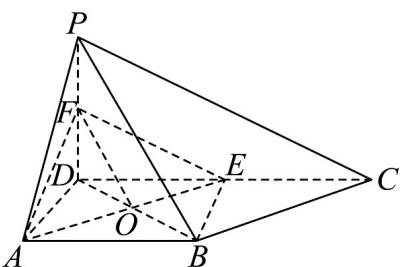
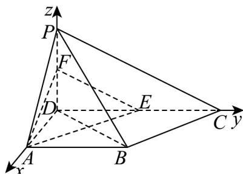

> [!faq]- 《专题03空间向量的应用四大常考题型_高效培优专项训练_》官方解析
>
> > [!success]- **【答案】** (1)证明见解析 (2) $\frac{\pi}{2}$
>
> > [!note]- **【分析】**
> > （1）首先证明四边形ABED是平行四边形，再根据中位线的性质，结合线面平行的判断定理，即可证明；
> >
> > (2) 以点 $D$ 为坐标原点， $DA, DC, DP$ 所在直线建立如图所示的空间直角坐标系，求出平面 $PBD$ 与平面 $CPB$ 的法向量，再结合向量夹角的余弦公式即可求解.
>
> > [!note]- **【解析】**
> > （1）
> >
> > 
> >
> > 如图，连接 $BE$ ，设BDI $AE = O$ ，连接OF
> >
> > 因 $AB // DC$ ， $DE = \frac{1}{2} DC = AB = 2$ ，可得四边形ABED是平行四边形，
> >
> > 则 $OD = OB$ ，又 $DF = PF$ ，则得 $OF / / PB$ ，
> >
> > 因 $OF \subset$ 平面 $AEF$ ， $PB \notin$ 平面 $AEF$ ，故 $PB //$ 平面 $AEF$ 。
> >
> > (2) 因为 $PD \perp$ 平面 ABCD， $DA, DC \subset$ 平面 ABCD
> >
> > 所以 $PD \perp DA, PD \perp DC$
> >
> > 因为 $AD \perp DC$ ，所以 DA, DC, DP 两两互相垂直，
> >
> > 所以以点 D 为坐标原点，DA, DC, DP 所在直线建立如图所示的空间直角坐标系，
> >
> > 
> >
> > 由题意可得 $D(0,0,0)$ , $B(2,2,0)$ , $C(0,4,0)$ , $P(0,0,2)$
> >
> > 所以 $\overline{PB} = (2, 2, -2), \overline{PD} = (0, 0, -2), \overline{PC} = (0, 4, -2)$
> >
> > 设平面 $PBC$ 与平面 $PBD$ 的法向量分别为 $\overline{n_1} = (x_1, y_1, z_1), \overline{n_2} = (x_2, y_2, z_2)$
> >
> > 所以有 $\left\{ \begin{array}{l} \square \square \square \\ PB \cdot n_1 = 2x_1 + 2y_1 - 2z_1 = 0 \\ \square \square \square \\ PC \cdot n_1 = 4y_1 - 2z_1 = 0 \end{array} \right.$ ， $\left\{ \begin{array}{l} \square \square \square \\ PB \cdot n_2 = 2x_2 + 2y_2 - 2z_2 = 0 \\ \square \square \square \\ PD \cdot n_2 = -2z_2 = 0 \end{array} \right.$
> >
> > 令 $y_{1} = y_{2} = 1$ ，解得 $z_{1} = 2, x_{1} = 1, z_{2} = 0, x_{2} = -1$
> >
> > 故可取 $n_1 = (1, 1, 2), n_2 = (-1, 1, 0)$
> >
> > 设所求为 $\theta, \theta \in \left[0, \frac{\pi}{2}\right]$ ，则 $\cos \theta = \frac{\left|\begin{array}{cc} \sqcup & \sqcup \\ n_1 & n_2 \end{array}\right|}{\left|\begin{array}{c|c} \square & \square \\ n_1 & n_2 \end{array}\right|} = 0$ ，所以 $\theta = \frac{\pi}{2}$ .
