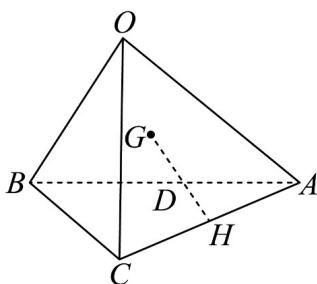

<!-- question-source:start -->
7. 如图，在四面体 $OABC$ 中，设 $OA = a, OB = b, OC = c$ ， $G$ 为 $\triangle OAB$ 的重心， $H$ 为 $AC$ 的中点，则 $GH = (\quad)$

A. $\frac{1}{6} a - \frac{1}{3} b + \frac{1}{2} c$ B. $-\frac{2}{3} a - \frac{1}{3} b - \frac{1}{3} c$ C. $\frac{1}{6} a - \frac{1}{3} b + \frac{1}{3} c$ D. $-\frac{2}{3} a - \frac{1}{3} b + \frac{1}{2} c$
<!-- question-source:end -->

![[高中/课堂同步/题库/人教A版高中数学同步讲义(2026)/03_选择性必修第一册/第一章 空间向量与立体几何/专题01 空间向量及其运算的四大常考题型（高效培优专项训练）/题型一_空间向量的有关概念及线性运算/questions/answers/Q00079676A1.md]]
