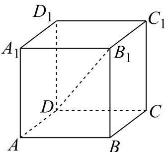

> [!faq]- 《专题01 空间向量及其运算的四大常考题型（高效培优专项训练）》官方解析
>
> > [!success]- **【答案】**  ① $\left(AB+BC\right)+CC_{1}$ ; ② $\left(AA_{1}+A_{1}D_{1}\right)+D_{1}C_{1}$ ③ $\left(AB+BB_{1}\right)+B_{1}C_{1}$ ; ④ $\left(AA_{1}+A_{1}B_{1}\right)+B_{1}C_{1}$ A. 1 B. 2 C. 3 D. 4
>
> > [!note]- **【分析】**
> > 根据空间向量的加法法则判断.
>
> > [!note]- **【解析】**
> > 由正方体 $AC_{1}$ ，空间向量的加法法则可得。
> >
> > $$
> > \left( \begin{array}{c} \sqcup \sqcup \\ A B + B C \end{array} \right) + \stackrel {{\sqcup \sqcup}} {{C}} C _ {1} = \stackrel {{\sqcup \sqcup}} {{A}} C + \stackrel {{\sqcup \sqcup}} {{C}} C _ {1} = \stackrel {{\sqcup \sqcup}} {{A}} C _ {1}; \left( \begin{array}{c} \sqcup \sqcup \\ A A _ {1} + A _ {1} D _ {1} \end{array} \right) + \stackrel {{\sqcup \sqcup}} {{D}} _ {1} C _ {1} = \stackrel {{\sqcup \sqcup}} {{A}} D _ {1} + \stackrel {{\sqcup \sqcup}} {{D}} _ {1} C _ {1} = \stackrel {{\sqcup \sqcup}} {{A}} C _ {1}
> > $$
> >
> > $\left( \begin{array}{cc} \sqcup \sqcup \sqcup & \sqcup \sqcup \sqcup \\ AB + BB_1 \end{array} \right) + \begin{array}{c}\sqcup \sqcup \sqcup \\ B_1C_1 = AB_1 + B_1C_1 = AC_1 \end{array} ; \quad \left( \begin{array}{cc} \sqcup \sqcup \sqcup & \sqcup \sqcup \sqcup \\ AA_1 + A_1B_1 \end{array} \right) + \begin{array}{c}\sqcup \sqcup \sqcup \\ B_1C_1 = AB_1 + B_1C_1 = AC_1 \end{array}$
> >
> > 故选 **D**.
