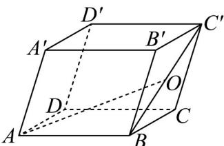

<!-- question-source:start -->
28. 如图，在平行六面体 $ABCD - A'B'C'D'$ 中， $AB = AD = AA' = 1$ ， $\angle DAB = 90^\circ$ ， $\angle A'AB = \angle A'AD = 60^\circ$ ，点 $O$ 为 $BC'$ 的中点， $AO = xAB + yAD + zAA'$ .

(1)求 $x+y+z$ 的值；

(2)求 AO 与 DC 所成的角的余弦值.
<!-- question-source:end -->

![[高中/课堂同步/题库/人教A版高中数学同步讲义(2026)/03_选择性必修第一册/第一章 空间向量与立体几何/专题01 空间向量及其运算的四大常考题型（高效培优专项训练）/题型三_空间向量的数量积/questions/answers/Q00079695A1.md]]
