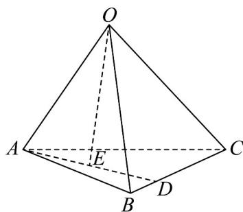

<!-- question-source:start -->
29. 如图，在空间四边形 $OABC$ 中， $D$ 为棱 $BC$ 上一点，且满足 $DC = 3BD$ ， $E$ 为线段 $AD$ 的中点，设 $\overline{OA} = a, \overline{OB} = b, \overline{OC} = c$ .

(1)试用向量a,b,c表示向量 $\overline{OE}$ ;

(2)若 $OA = OB = 4,OC = 3,\angle AOB = \angle AOC = \angle BOC = 60^{\circ}$ ，求 $\overline{OE}\cdot \overline{BC}$ 的值.
<!-- question-source:end -->

![[高中/课堂同步/题库/人教A版高中数学同步讲义(2026)/03_选择性必修第一册/第一章 空间向量与立体几何/专题01 空间向量及其运算的四大常考题型（高效培优专项训练）/题型三_空间向量的数量积/questions/answers/Q00079696A1.md]]
