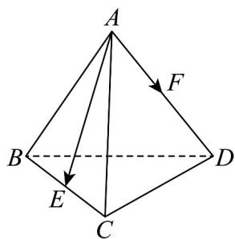

> [!faq]- 《专题01 空间向量及其运算的四大常考题型（高效培优专项训练）》官方解析
>
> > [!success]- **【答案】** A. $\frac{\sqrt{3}}{4} a^2$ B. $\frac{1}{2} a^2$ C. $a^2$ D. $\frac{1}{4} a^2$
>
> > [!note]- **【分析】**
> > 根据题意，得到 $AE=\frac{1}{2}(AB+AC)$ ， $AF=\frac{1}{2}AD$ ，结合向量的数量积的定义与运算，即可求得 $AE\cdot AF$ 的值，得到答案.
>
> > [!note]- **【解析】**
> > 如图所示，因为 $E, F$ 分别为 $BC, AD$ 的中点，可得 $\overline{AE} = \frac{1}{2} (AB + AC)$ ， $\overline{AF} = \frac{1}{2} \overline{AD}$ ，又因为四面体 $ABCD$ 为正四面体，且棱长为 $a$ ，
> >
> > 可得 $\overline{AE} \cdot \overline{AF} = \frac{1}{4} (\overline{AB} + \overline{AC}) \cdot \overline{AD} = \frac{1}{4} (\overline{AB} \cdot \overline{AD} + \overline{AC} \cdot \overline{AD})$ $=\frac{1}{4}\left(\left|\overline{AB}\right|\cdot\left|\overline{AD}\right|\cos\frac{\pi}{3}+\left|\overline{AC}\right|\right|\overline{AD}\left|\cos\frac{\pi}{3}\right)=\frac{1}{4}(a^{2}\times\frac{1}{2}+a^{2}\times\frac{1}{2})=\frac{1}{4}a^{2}.$
> >
> > 故选：D.
> >
> > 
