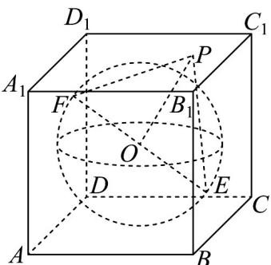

> [!faq]- 《专题01 空间向量及其运算的四大常考题型（高效培优专项训练）》官方解析
>
> > [!success]- **【答案】** B
>
> > [!note]- **【分析】**
> > 根据空间向量的加法运算和数量积的运算律求解
>
> > [!note]- **【解析】**
> > 由题意可得，球 O 的半径为 $^{1}$ . $PE \cdot PF = (PO + OE) \cdot (PO + OF)$ $PO^{2} + PO \cdot OF + PO \cdot OE + OE \cdot OF$ $PO^{2} + OE \cdot OF = PO^{2} - 1 \leq (\sqrt{3})^{2} - 1 = 2$ . 当 P 为正方体顶点时等号成立，
> >
> > 
> >
> > 故选 **B**
