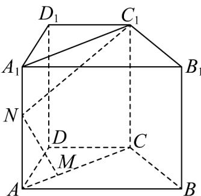

> [!faq]- 《专题01 空间向量及其运算的四大常考题型（高效培优专项训练）》官方解析
>
> > [!success]- **【答案】** B
>
> > [!note]- **【分析】**
> > 设 $AA_{1}=h$ ， $AN=tAA_{1}$ ， $t\in[0,1]$ ，将向量 $NM,NC_{1}$ 分别用 $AA_{1},AC$ 表示，代入 $NM\cdot NC_{1}=0$ ，利用向量数量积的运算律化简，求得 $h^{2}=\frac{9}{-t^{2}+t}=\frac{9}{-(t-\frac{1}{2})^{2}+\frac{1}{4}}$ ，借助于二次函数的性质即可求得 $AA_{1}$ 的最小值·
>
> > [!note]- **【解析】**
> > 
> >
> > 设 $AA_{1}=h$ ， $AN=tAA_{1}$ ， $t\in[0,1]$ ，
> >
> > 则 $NM = AM - AN = \frac{1}{3} AC - tAA_{1}$ ， $NC_{1} = NA_{1} + A_{1}C_{1} = (1 - t)AA_{1} + AC$
> >
> > 由 $\frac{\square\square\square\square}{NM}\cdot\frac{\square\square\square\square}{NC_{1}}=\left(\frac{1}{3}AC-tAA_{1}\right)\cdot\left[AC+(1-t)AA_{1}\right]=\frac{1}{3}AC^{2}+t(t-1)AA_{1}^{2}+\frac{1-4t}{3}AA_{1}\cdot AC=0$
> >
> > 因 $AC = 3\sqrt{3}$ ， $AA_{1} \perp AC$ ，则 $AC^{2} = 27, AA_{1}^{2} = h^{2}, AA_{1} \cdot AC = 0$
> >
> > 代入整理得， $t(t-1)h^{2}+9=0$ ，显然 $t(t-1)\neq0$ ，故 $h^{2}=\frac{9}{-t^{2}+t}=\frac{9}{-(t-\frac{1}{2})^{2}+\frac{1}{4}}$ ，
> >
> > 因 $0 < t < 1$ ，故当 $t = \frac{1}{2}$ 时， $y = -(t - \frac{1}{2})^2 + \frac{1}{4}$ 取得最大值 $\frac{1}{4}$
> >
> > 此时 $h^{2}$ 取得最小值为 36，故 $AA_{1}$ 的最小值为为 6.
> >
> > 故选 **B**.
