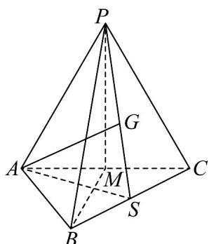

> [!faq]- 《专题01 空间向量及其运算的四大常考题型（高效培优专项训练）》官方解析
>
> > [!success]- **【答案】** (1)证明见解析， $\frac{\sqrt{15}}{5}$ (2) $AG=\frac{1}{3}\left(AP+AB+AC\right)$ ， $\left|AG\right|=\frac{2}{3}a$
>
> > [!note]- **【分析】**
> > （1）先根据线面垂直的判定定理证明线面垂直，进而得到面面垂直，再依据线面角的定义找出线面角，最后通过相关线段长度计算线面角的正切值·
> >
> > (2) 根据重心性质得到 $AG$ 关于 $AP$ 、 $AB$ 、 $AC$ 的表达式，再对其平方，结合已知的角度和垂直关系计算数量积，进而求出 $AG$ 的模长.
>
> > [!note]- **【解析】**
> > （1）因为 $PA \perp AB$ ， $AC \perp AB$ ，而 $PA \cap AC = A$ ， $PA, AC \subset$ 平面 PAC，
> >
> > $AB \perp$ 平面 PAC，而 $AB \subset$ 平面 ABC，故平面 $ABC \perp$ 平面 PAC，
> >
> > 又 $PA = PC$ ， $M$ 为 $AC$ 的中点，故 $PM \perp AC$ ，而 $PM \subset$ 平面 $PAC$ ，平面 $PAC \cap$ 平面 $ABC = AC$ ，故 $PM \perp$ 平面 $ABC$ ：
> >
> > 由（1）可得 $PM \perp$ 平面 $ABC$ ，故 $\angle PBM$ 为 $PB$ 与平面 $ABC$ 所成的角，
> >
> > 因为 $PA = PC = AC = a$ ， $M$ 为 $AC$ 的中点，故 $PM = \frac{\sqrt{3}}{2} a$ ，而 $AB \perp AC$ ，故 $BM = \sqrt{a^2 + \left(\frac{a}{2}\right)^2} = \frac{\sqrt{5}}{2} a$ ，而平面，平面，故 $\tan \angle PBM = \frac{\frac{\sqrt{3}}{2} a}{\frac{\sqrt{5}}{2} a} = \frac{\sqrt{15}}{5}$ 。
> >
> > (2)
> >
> > 
> >
> > 因为 $G$ 为 $\triangle PBC$ 的重心，连接 $PG$ 并延长交 $BC$ 与S，连接 $AS$ ，则 $PG = 2GS$
> >
> > 故 $AG - AP = 2\left( \begin{array}{cc} \cup & \cup \\ AS & -AG \end{array} \right)$ ，故 $AG = \frac{1}{3}AP + \frac{2}{3}AS = \frac{1}{3}\left( \begin{array}{cc} \square & \square \\ AP & AB \\ AC \end{array} \right)$ ，
> >
> > 故 $AG^{2}=\frac{1}{9}\left(AP^{2}+AB^{2}+AC^{2}+2AP\cdot AB+2AP\cdot AC+2AC\cdot AB\right)$
> >
> > 而 $\angle PAC = 60^{\circ}$ ， $\angle BAC = 90^{\circ}$ ，又 $AB\bot$ 平面APC， $AP\subset$ 平面APC，故 $AB\bot AP$
> >
> > 故 $AG^{2}=\frac{1}{9}\left(a^{2}+a^{2}+a^{2}+a^{2}\right)=\frac{4}{9}a^{2}$ ，故 $\left|AG\right|=\frac{2}{3}a$ .
