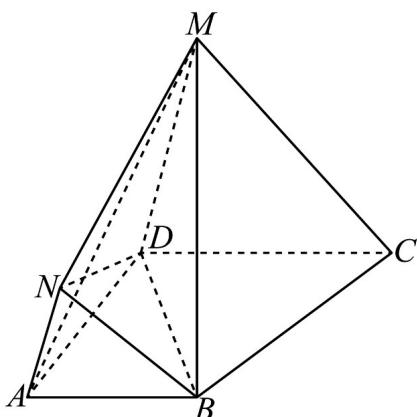

<!-- question-source:start -->
20. 如图，已知 $M, N$ 是平面 $ABCD$ 外两点， $DC = 2AB, DM = 2AN, AD \perp DC, AD \perp DM$ .

(1)求证： $BN \parallel$ 平面 MDC；

(2)若 $\angle MDC = \frac{\pi}{3}, AD = AB = 2AN = 4$ ，求该几何体的体积.
<!-- question-source:end -->

![[高中/课堂同步/题库/人教A版高中数学同步讲义(2026)/03_选择性必修第一册/第一章 空间向量与立体几何/专题01 空间向量及其运算的四大常考题型（高效培优专项训练）/题型二_共线向量定理的应用/questions/answers/Q00079687A1.md]]
