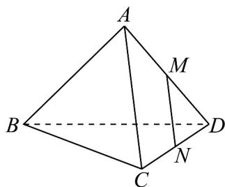

> [!faq]- 《专题01 空间向量及其运算的四大常考题型（高效培优专项训练）》官方解析
>
> > [!success]- **【答案】**  A. CA B. AC C. NM D. MN
>
> > [!note]- **【分析】**
> > 由中点的向量公式与向量的减法运算即可得到答案·
>
> > [!note]- **【解析】**
> > 如图所示，连接 $BM, BN$ ，因为 $M, N$ 分别是棱 $AD, CD$ 的中点，所以 $\frac{1}{2}\left(BD + BA\right) - \frac{1}{2}\left(BD + BC\right) = BM - BN = NM.$
> >
> > 
> >
> > 故选 **C**.
