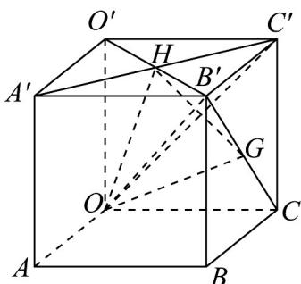

<!-- question-source:start -->
35. 如图，在棱长为 $^{1}$ 的正方体 $OABC - O'A'B'C'$ 中，G、H分别是侧面 $BB'C'C$ 和 $O'A'B'C'$ 的中心。设 $\overline{OA} = a$ ， $\overline{OC} = b$ ， $\overline{OO'} = c$ 。

(1)用向量 a 、 b 、 c 表示 $OB'$ 、 GH ;

(2)求 $GH \cdot BC'$ ;

(3) 判断 $AC'$ 与 GH 是否垂直.
<!-- question-source:end -->

![[高中/课堂同步/题库/人教A版高中数学同步讲义(2026)/03_选择性必修第一册/第一章 空间向量与立体几何/专题01 空间向量及其运算的四大常考题型（高效培优专项训练）/题型四_利用空间向量的数量积证垂直/questions/answers/Q00079702A1.md]]
