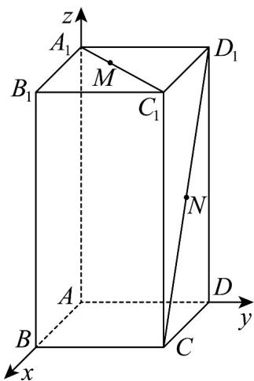

> [!faq]- 《专题01 空间向量及其运算的四大常考题型（高效培优专项训练）》官方解析
>
> > [!success]- **【答案】** （1） $\frac{\sqrt{53}}{3}$ ；（2）直线MN与直线 $BD_{1}$ 不垂直，理由见解析
>
> > [!note]- **【分析】**
> > （1）建立空间直角坐标系，写出 M 、 N 两点的坐标，利用两点之间的距离公式即可求出；
> >
> > (2) 写出 $MN$ ， $BD_{1}$ 的坐标，利用数量积判断.
>
> > [!note]- **【解析】**
> > 解： $(1)$ 建立如图所示空间直角坐标系 O-xyz
> >
> > 
> >
> > $A(0,0,0)$ $B(2,0,0)$ $C(2,2,0)$ $A_{1}(0,0,4)$ $C_1(2,2,4)$ $D_{1}(0,2,4)$
> >
> > 因为 $\left|MC_1\right| = 2\left|A_1M\right|$ ，所以 $A_{1}M = \frac{1}{3} A_{1}C_{1}$
> >
> > 得 $M\left(\frac{2}{3}, \frac{2}{3}, 4\right)$
> >
> > 又 N 为 $CD_{1}$ 中点，所以 $N(1,2,2)$
> >
> > 所以 $\left|MN\right|=\sqrt{\left(1-\frac{2}{3}\right)^{2}+\left(2-\frac{2}{3}\right)^{2}+\left(2-4\right)^{2}}=\frac{\sqrt{53}}{3}$ ;
> >
> > (2) $MN = \left(\frac{1}{3}, \frac{4}{3}, -2\right)$ , $BD_{1} = (-2, 2, 4)$ ，
> >
> > 所以 $MN \cdot BD_{1} = \left( \frac{1}{3}, \frac{4}{3}, -2 \right) \cdot (-2, 2, 4) = \frac{-2}{3} + \frac{8}{3} - 8 = -6$
> >
> > $$
> > M N \cdot B D _ {1} \neq 0
> > $$
> >
> > 所以直线 MN 与直线 $BD_{1}$ 不垂直.
