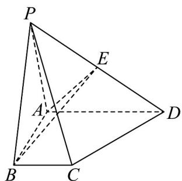

> [!faq]- 《专题02 空间向量基本定理及其坐标表示四大常考题型（高效培优专项训练）》官方解析
>
> > [!success]- **【答案】**  A. $\frac{5}{12}$ B. $\frac{1}{2}$ C. $\frac{2}{3}$ D. $\frac{3}{4}$
>
> > [!note]- **【分析】**
> > 根据空间向量基本定理，选择 $\left\{ \begin{array}{lll} \overline{\mathrm{PU}} & \overline{\mathrm{U}} & \overline{\mathrm{U}} \\ PA, AB, AD \end{array} \right\}$ 作为基底分别表示 $PF$ 和 $PC$ 向量，再根据向量共线的条件 $PF = \lambda PC$ 求出参数 $\lambda$ 即可·
>
> > [!note]- **【解析】**
> > 选择 $\left\{PA,AB,AD\right\}$ 作为基底， $PC=PA+AB+BC=PA+AB+\frac{1}{2}AD$ ;
> >
> > $\overline{PF}=\overline{PA}+\overline{AF}$ ，由已知F点在平面ABE内，即 $\overline{AF}$ 与 $\overline{AB}$ ， $\overline{AE}$ 共面，可得 $\overline{AF}=m\overline{AB}+n\overline{AE}$
> >
> > 又由 $E$ 是 $PD$ 的中点，可得 $\overline{AE} = \frac{1}{2}\overline{AP} +\frac{1}{2}\overline{AD}$ ，代换可得：
> >
> > $$
> > P F = (1 - \frac {1}{2} n) P A + m A B + \frac {1}{2} n A D
> > $$
> >
> > $\overline{PF}$ 与 $\overline{PC}$ 共线，即 $\overline{PF}=\lambda\overline{PC}$ ，可得： $\overline{PF}=\lambda\overline{PA}+\lambda\overline{AB}+\frac{1}{2}\lambda\overline{AD}$ ，即 $\left\{\begin{aligned}\lambda&=1-\frac{1}{2}n\\ \lambda&m\end{aligned}\right.$ ，解得 $\frac{1}{2}\lambda=\frac{1}{2}n,\quad\lambda=m=n=\frac{2}{3}$
> >
> > 故选 **C**
