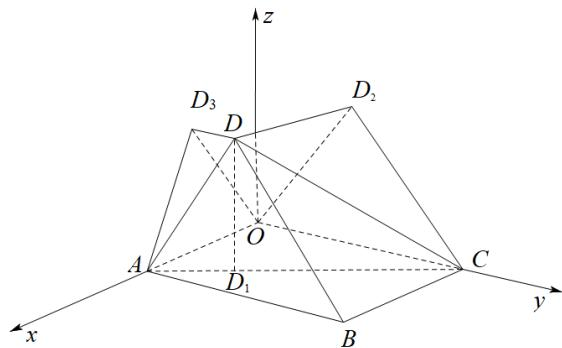

> [!faq]- 《专题02 空间向量基本定理及其坐标表示四大常考题型（高效培优专项训练）》官方解析
>
> > [!success]- **【答案】** A. $S_2 < S_1 < S_3$ B. $S_3 < S_1 < S_2$ C. $S_3 < S_2 < S_1$ D. $S_1 < S_3 < S_2$
>
> > [!note]- **【分析】**
> > 求点 D 在 xOy, yOz, zOx 坐标平面上的正投影，进而可求 $S_{1}$ ， $S_{2}$ ， $S_{3}$ ，即可比较大小。
>
> > [!note]- **【解析】**
> > 由题意可知：点 $D$ 在 $xOy, yOz, zOx$ 坐标平面上的正投影分别为 $D_{1}\left(\frac{3}{2}, 1, 0\right), D_{2}\left(0, 1, 2\sqrt{2}\right), D_{3}\left(\frac{3}{2}, 0, 2\sqrt{2}\right)$ ，
> >
> > 
> >
> > 因为 $AD_{1}=\left(-\frac{1}{2},1,0\right),AC=\left(-2,4,0\right)$ ，则 $AC=4AD_{1}$ ，可知 $A,D_{1},C$ 三点共线，
> > 可得 $S_{1}=S_{\triangle ABC}=\frac{1}{2}\times2\times4=4,\quad S_{2}=S_{\triangle OCD_{2}}=\frac{1}{2}\times4\times2\sqrt{2}=4\sqrt{2},\quad S_{3}=S_{\triangle OAD_{2}}=\frac{1}{2}\times2\times2\sqrt{2}=2\sqrt{2}$ 所以 $S_{3}<S_{1}<S_{2}$
> >
> > 故选 **B**.
